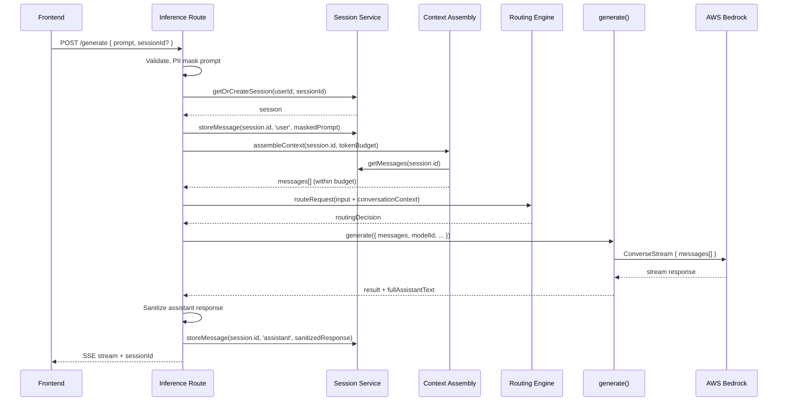
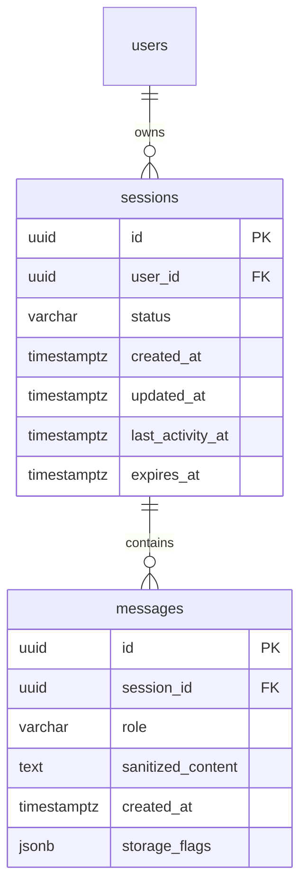

# Design Document: Conversation Memory

## Overview

This design adds server-side multi-turn conversation memory to the Unified Inference Gateway. The system stores sanitized conversation turns in PostgreSQL, retrieves them at inference time, and assembles a context window that fits within a configurable token budget before sending the full message history to AWS Bedrock ConverseStream.

The design follows a layered approach:
- **Persistence layer**: New `sessions` and `messages` tables (migration 004)
- **Session service**: CRUD operations, lifecycle management, expiry enforcement
- **Context assembly service**: Token estimation, recency-first selection, truncation, optional summary compaction
- **Route integration**: Existing inference routes accept an optional `sessionId`, store turns, and pass assembled history to `generate()`
- **Frontend integration**: Session state management, history loading on page refresh, new-chat reset

All stored content passes through the existing `mask()` function before persistence. Assistant responses are also sanitized before storage. The design preserves existing auth, routing, rate-limiting, and audit behaviors.

## Architecture





## Components and Interfaces

### 1. Session Service (`src/services/session.service.ts`)

Manages session lifecycle: creation, retrieval, expiry checks, message CRUD.

```typescript
interface Session {
  id: string;               // UUID
  userId: string;           // FK → users.id
  status: 'active' | 'inactive' | 'expired';
  createdAt: string;        // ISO 8601
  updatedAt: string;
  lastActivityAt: string;
  expiresAt: string;
}

interface StoredMessage {
  id: string;               // UUID
  sessionId: string;
  role: 'user' | 'assistant';
  sanitizedContent: string;
  createdAt: string;        // ISO 8601
  storageFlags: StorageFlags;
}

interface StorageFlags {
  piiMasked: boolean;
  assistantSanitized?: boolean;
  partiallyPersisted?: boolean;
}

// Service API
function getOrCreateSession(userId: string, sessionId?: string): Promise<Session>;
function getActiveSession(userId: string): Promise<Session | null>;
function getSessionMessages(sessionId: string, limit?: number): Promise<StoredMessage[]>;
function storeMessage(sessionId: string, role: 'user' | 'assistant', content: string, flags: StorageFlags): Promise<StoredMessage>;
function markSessionInactive(sessionId: string): Promise<void>;
function isSessionExpired(session: Session): boolean;
function touchSession(sessionId: string): Promise<void>;
```

**Behavior details:**
- `getOrCreateSession`: If `sessionId` is provided and valid (active, owned by user, not expired), returns it. Otherwise creates a new session with `expiresAt = now + config.session.expiryHours`.
- `getSessionMessages`: Returns messages ordered by `created_at ASC`, tie-broken by `id ASC`.
- `storeMessage`: Inserts message and calls `touchSession` to update `last_activity_at` and `updated_at`.
- Expired sessions are detected at read time (comparing `expires_at` with current time). A background sweep is not required for MVP but the schema supports it.

### 2. Context Assembly Service (`src/services/context-assembly.service.ts`)

Selects which stored messages to include in the Bedrock request, respecting token budgets.

```typescript
interface ContextAssemblyConfig {
  tokenBudget: number;          // Max tokens for history (default 200,000)
  safetyMargin: number;         // Reserved for current prompt + system + response (default 20,000)
  summaryThreshold: number;     // Messages before summary triggers (default 40)
  charsPerToken: number;        // Approximation ratio (default 4)
}

interface AssembledContext {
  messages: BedrockMessage[];   // Ordered user/assistant pairs for ConverseStream
  totalEstimatedTokens: number;
  truncated: boolean;
  truncatedCount: number;       // Number of messages dropped
  summarized: boolean;
  originalMessageCount: number;
}

interface BedrockMessage {
  role: 'user' | 'assistant';
  content: Array<{ text: string }>;
}

// Service API
function assembleContext(
  sessionMessages: StoredMessage[],
  currentPrompt: string,
  config: ContextAssemblyConfig
): AssembledContext;

function estimateTokens(text: string, charsPerToken: number): number;
```

**Assembly algorithm:**
1. Calculate available budget: `tokenBudget - safetyMargin`
2. Start from the most recent messages (excluding the current prompt which is appended separately)
3. Accumulate messages from most-recent backwards, estimating tokens for each
4. If total messages exceed `summaryThreshold` and a summary service is configured, generate a Summary_Block for the oldest included turns
5. If budget is exceeded, drop oldest messages until budget is satisfied
6. Return messages re-ordered chronologically for the Bedrock request
7. The current user message is always appended as the final message (not stored in `assembledContext.messages` — the route appends it)

**Token estimation:** `Math.ceil(text.length / charsPerToken)` — clearly documented as an approximation.

### 3. Modified `generate()` Function

The existing `generate()` accepts a single-message `InferenceRequest`. The new version accepts a `ConversationInferenceRequest` with a pre-built messages array.

```typescript
interface ConversationInferenceRequest {
  messages: BedrockMessage[];   // Full conversation history + current prompt
  modelId: string;
  userId: string;
  inferenceConfig?: {
    maxTokens?: number;
    temperature?: number;
    topP?: number;
  };
}

// New overload
function generate(
  request: ConversationInferenceRequest,
  res: Response,
): Promise<ConversationInferenceResult>;

interface ConversationInferenceResult extends InferenceResult {
  assistantText: string;  // Full accumulated assistant response for storage
}
```

The existing single-prompt signature remains for backwards compatibility. Internally, the function checks whether `request.messages` is present:
- If yes: use the messages array directly in the `ConverseStreamCommand`
- If no: wrap `maskedPrompt` in a single user message (current behavior)

The function accumulates the full assistant text from `contentBlockDelta` events and returns it in the result for storage.

### 4. Session API Endpoints

Added to `src/routes/inference.routes.ts`:

**GET `/api/v1/inference/sessions/active`**
- Auth: `authMiddleware`
- Returns: `{ session: Session | null, messages: Array<{ role, content, createdAt }> }`
- When no active session: returns `{ session: null, messages: [] }`

**POST `/api/v1/inference/sessions/reset`**
- Auth: `authMiddleware`
- Marks active session as `inactive`
- Returns: `{ success: true }`
- Idempotent: returns success even if no active session exists

### 5. Routing Engine Enrichment

The routing engine's `RoutingInput` gains an optional `conversationContext` field:

```typescript
interface RoutingInput {
  // ... existing fields
  conversationContext?: string;  // Compact recent-turns text for scoring
}
```

The inference route builds this by taking the last 2 prior user messages (excluding the current prompt), concatenated, and capped at 500 characters total. This is passed to the scoring prompt but not the refinement prompt.

### 6. Audit Logging Additions

Extended `AuditEntry` interface:

```typescript
interface AuditEntry {
  // ... existing fields
  sessionId?: string;
  replayedMessageCount?: number;
  contextTruncated?: boolean;
  contextSummarized?: boolean;
}
```

The audit service INSERT query gains 4 new columns (migration 004 adds them to `audit_logs`).

### 7. Frontend Changes (`public/index.html`)

- **State**: Track `currentSessionId` in a module-scoped variable
- **On page load**: Fetch `GET /api/v1/inference/sessions/active`, render history messages, set `currentSessionId`
- **On send**: Include `sessionId` in the request body; on response, extract `sessionId` from the SSE `session` event and store it
- **New Chat button**: Calls `POST /api/v1/inference/sessions/reset`, clears chat UI and `currentSessionId`
- **Error handling**: If server returns 404/410 for session, clear local state and start fresh

## Data Models

### Migration 004: `migrations/004_conversation_memory.sql`

```sql
-- Sessions table
CREATE TABLE sessions (
    id              UUID PRIMARY KEY DEFAULT gen_random_uuid(),
    user_id         UUID NOT NULL REFERENCES users(id),
    status          VARCHAR(16) NOT NULL DEFAULT 'active'
                    CHECK (status IN ('active', 'inactive', 'expired')),
    created_at      TIMESTAMPTZ NOT NULL DEFAULT NOW(),
    updated_at      TIMESTAMPTZ NOT NULL DEFAULT NOW(),
    last_activity_at TIMESTAMPTZ NOT NULL DEFAULT NOW(),
    expires_at      TIMESTAMPTZ NOT NULL
);

CREATE INDEX idx_sessions_user_active ON sessions(user_id, status)
    WHERE status = 'active';
CREATE INDEX idx_sessions_expires_at ON sessions(expires_at);

-- Messages table
CREATE TABLE messages (
    id              UUID PRIMARY KEY DEFAULT gen_random_uuid(),
    session_id      UUID NOT NULL REFERENCES sessions(id) ON DELETE CASCADE,
    role            VARCHAR(16) NOT NULL CHECK (role IN ('user', 'assistant')),
    sanitized_content TEXT NOT NULL,
    created_at      TIMESTAMPTZ NOT NULL DEFAULT NOW(),
    storage_flags   JSONB NOT NULL DEFAULT '{}'::jsonb
);

CREATE INDEX idx_messages_session_order ON messages(session_id, created_at ASC, id ASC);

-- Audit log additions
ALTER TABLE audit_logs ADD COLUMN session_id UUID;
ALTER TABLE audit_logs ADD COLUMN replayed_message_count INTEGER;
ALTER TABLE audit_logs ADD COLUMN context_truncated BOOLEAN DEFAULT FALSE;
ALTER TABLE audit_logs ADD COLUMN context_summarized BOOLEAN DEFAULT FALSE;
```

### Configuration Additions (`src/config/index.ts`)

```typescript
session: {
  expiryHours: parseInt(process.env.SESSION_EXPIRY_HOURS || '24', 10),
  tokenBudget: parseInt(process.env.SESSION_TOKEN_BUDGET || '200000', 10),
  safetyMargin: parseInt(process.env.SESSION_SAFETY_MARGIN || '20000', 10),
  summaryThreshold: parseInt(process.env.SESSION_SUMMARY_THRESHOLD || '40', 10),
  charsPerToken: parseInt(process.env.SESSION_CHARS_PER_TOKEN || '4', 10),
  routingContextMaxChars: parseInt(process.env.SESSION_ROUTING_CONTEXT_MAX_CHARS || '500', 10),
  routingContextMaxTurns: parseInt(process.env.SESSION_ROUTING_CONTEXT_MAX_TURNS || '2', 10),
}
```


## Correctness Properties

*A property is a characteristic or behavior that should hold true across all valid executions of a system — essentially, a formal statement about what the system should do. Properties serve as the bridge between human-readable specifications and machine-verifiable correctness guarantees.*

### Property 1: Session creation ownership

*For any* authenticated user ID and any call to `getOrCreateSession` without a valid active session ID, the returned session SHALL have `userId` equal to the caller's ID, `status` equal to `'active'`, and a valid `expiresAt` in the future.

**Validates: Requirements 1.1**

### Property 2: Message append grows list by one

*For any* active session and any valid sanitized content string, calling `storeMessage` SHALL increase the session's message count by exactly one, and the new message SHALL have the correct role, content, and sessionId.

**Validates: Requirements 1.2**

### Property 3: Session reset then create produces new session

*For any* user with an active session, calling `markSessionInactive` on that session followed by `getOrCreateSession` SHALL return a session with a different ID than the original, with status `'active'`.

**Validates: Requirements 1.4**

### Property 4: Expired sessions are rejected

*For any* session whose `expiresAt` is before the current time, `getOrCreateSession` called with that session's ID SHALL NOT return that session; it SHALL create or return a different active session.

**Validates: Requirements 1.6**

### Property 5: User messages stored and replayed only in sanitized form

*For any* user prompt text, the content persisted in the Session_Store SHALL equal `mask(prompt).maskedText`, and the content included in any assembled Context_Window for model replay SHALL equal the stored sanitized content.

**Validates: Requirements 2.1, 2.2, 6.1, 6.2**

### Property 6: Assistant messages sanitized before storage

*For any* assistant response text, the content persisted in the Session_Store SHALL be the result of applying the sanitization function to the raw assistant output, not the raw text itself.

**Validates: Requirements 2.3, 6.3**

### Property 7: Message retrieval ordering

*For any* session with multiple messages, `getSessionMessages` SHALL return them ordered by `created_at` ascending, with deterministic tie-breaking by `id` ascending when timestamps are equal.

**Validates: Requirements 2.5**

### Property 8: Exactly one assistant message per inference

*For any* successful inference request within a session, exactly one message with role `'assistant'` SHALL be stored, containing the complete concatenated response text (not partial stream deltas).

**Validates: Requirements 2.7**

### Property 9: Context window budget invariant

*For any* session history and any token budget configuration, the assembled Context_Window's total estimated tokens SHALL NOT exceed `tokenBudget - safetyMargin`. When the raw history exceeds this budget, the oldest messages SHALL be dropped first.

**Validates: Requirements 3.3, 3.5, 3.8**

### Property 10: Context window chronological order

*For any* assembled Context_Window, messages SHALL appear in chronological order (ascending by original creation timestamp), and the final message SHALL be the current user prompt.

**Validates: Requirements 3.1, 3.2**

### Property 11: Token estimation formula

*For any* non-empty text string and any positive `charsPerToken` value, `estimateTokens(text, charsPerToken)` SHALL return `Math.ceil(text.length / charsPerToken)`.

**Validates: Requirements 4.3**

### Property 12: Routing context bounds

*For any* session history, the routing context string SHALL contain only prior user-role messages (excluding the current prompt), include at most `routingContextMaxTurns` messages, and have total length at most `routingContextMaxChars` characters.

**Validates: Requirements 7.2, 7.3**

### Property 13: Reset endpoint idempotence

*For any* user, calling the session reset operation N times (N ≥ 1) SHALL produce the same observable state as calling it once: the previously active session (if any) is inactive, and no errors are raised.

**Validates: Requirements 8.6**

### Property 14: Audit entries contain session metadata without raw content

*For any* inference request processed within a session, the audit log entry SHALL include `sessionId`, `replayedMessageCount`, and `contextTruncated` flag, and SHALL NOT contain any raw message text in any field.

**Validates: Requirements 9.1, 9.2, 9.3, 9.4**

## Error Handling

| Scenario | Behavior | User Impact |
|----------|----------|-------------|
| Session DB read failure | Log error, create new ephemeral session (no history replay) | Single-turn mode, no visible error |
| Message persistence failure | Continue inference, flag session as `partiallyPersisted`, log error | Response streams normally; history may have gap |
| Token budget exceeded after truncation | Drop all history, send current prompt only | Response may lack context but succeeds |
| Session expired mid-conversation | Create new session transparently, return new sessionId | Client updates sessionId; prior history inaccessible |
| Invalid/foreign sessionId in request | Ignore invalid ID, create new session | Fresh start, no error shown |
| Context assembly timeout | Skip history assembly, proceed with current prompt only | Single-turn fallback |
| Assistant sanitization failure | Store message with `sanitizationFailed` flag, log error | Message stored as-is (fail-open for MVP; configurable for regulated) |
| GET /sessions/active with no session | Return 200 with `{ session: null, messages: [] }` | Frontend shows empty chat |
| POST /sessions/reset with no active session | Return 200 `{ success: true }` (idempotent) | No-op, no error |

**Design principle**: Session memory is additive and best-effort. Failures in session/history operations never block the core inference path. The system degrades gracefully to single-turn behavior.

## Testing Strategy

### Unit Tests

- **Session service**: Test creation, retrieval, expiry detection, reset, message CRUD with mocked DB
- **Context assembly**: Test budget enforcement, truncation, ordering, edge cases (empty history, single message, exactly-at-budget)
- **Token estimation**: Test formula correctness with various string lengths
- **Routing context builder**: Test turn selection, character capping, exclusion of current prompt
- **Audit entry enrichment**: Test that session fields are populated correctly

### Property-Based Tests (fast-check)

Property-based testing is appropriate here because the context assembly service is a pure function with clear input/output behavior, the session service has universal invariants, and the token estimation is a pure function. The input space (conversation histories of varying lengths, message content, budget configurations) is large and benefits from randomized exploration.

**Library**: `fast-check` (already in devDependencies)
**Minimum iterations**: 100 per property
**Tag format**: `Feature: conversation-memory, Property {N}: {title}`

Properties to implement:
1. Session creation ownership (Property 1)
2. Message append grows list by one (Property 2)
3. Session reset then create produces new session (Property 3)
4. Expired sessions are rejected (Property 4)
5. User messages stored only in sanitized form (Property 5)
6. Assistant messages sanitized before storage (Property 6)
7. Message retrieval ordering (Property 7)
8. Context window budget invariant (Property 9)
9. Context window chronological order (Property 10)
10. Token estimation formula (Property 11)
11. Routing context bounds (Property 12)
12. Reset endpoint idempotence (Property 13)
13. Audit entries contain metadata without raw content (Property 14)

Property 8 (exactly one assistant message per inference) is better tested as an integration test since it involves the full streaming pipeline.

### Integration Tests

- Full inference flow with sessionId: send prompt → receive response → verify session and messages in DB
- Page refresh flow: create session → add messages → GET /sessions/active → verify history
- Session expiry: create session → advance clock → attempt use → verify new session created
- Concurrent message writes: parallel requests to same session → verify ordering
- Reset flow: active session → POST reset → verify inactive → new request creates new session
