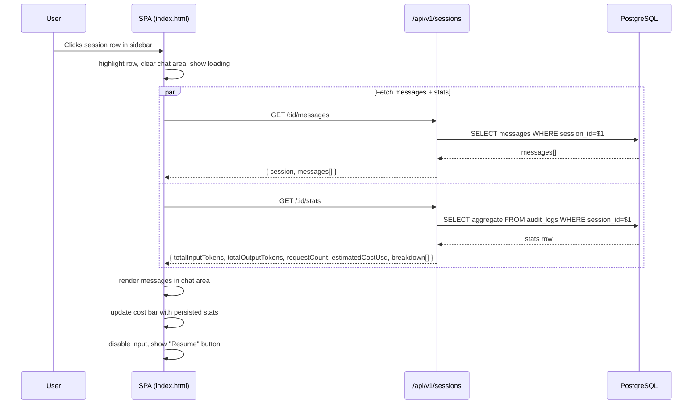
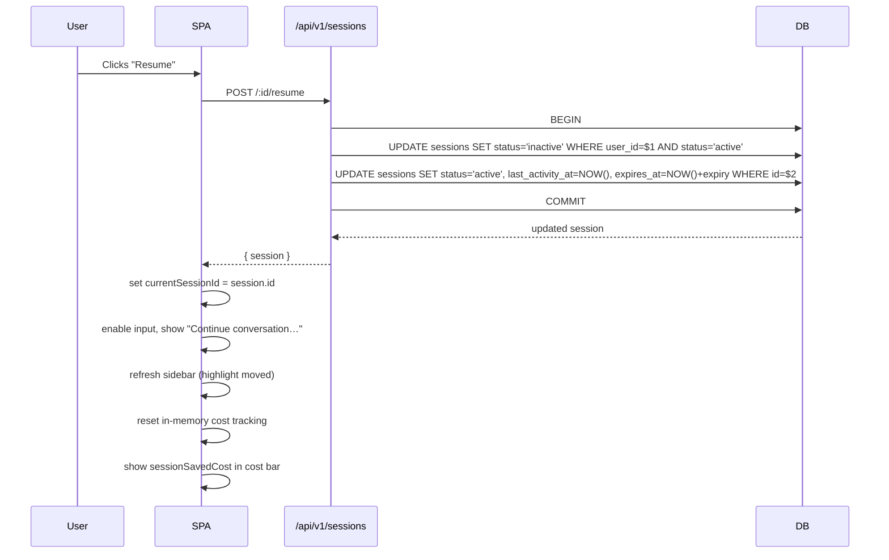
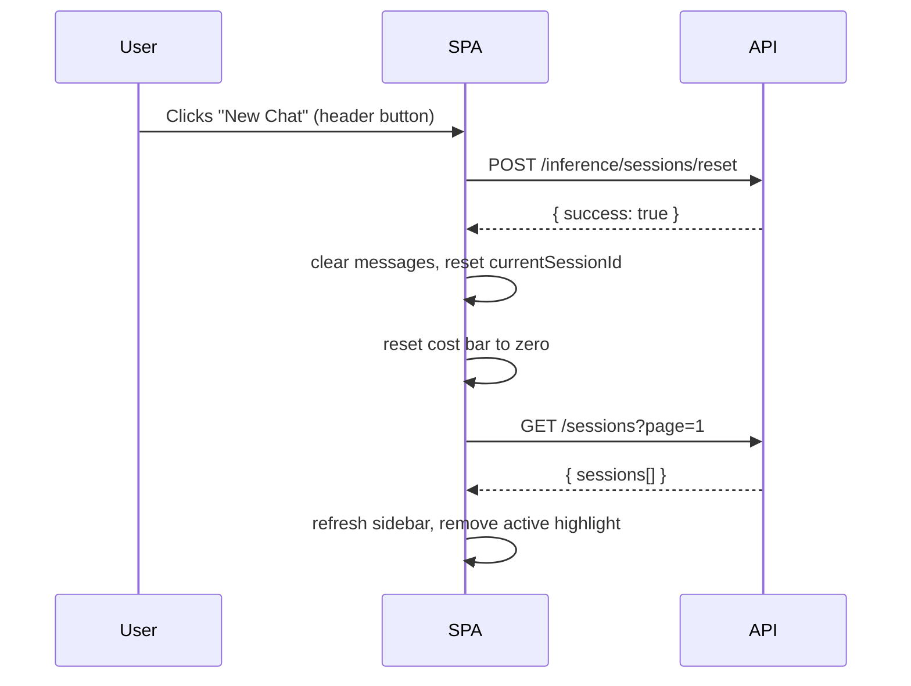
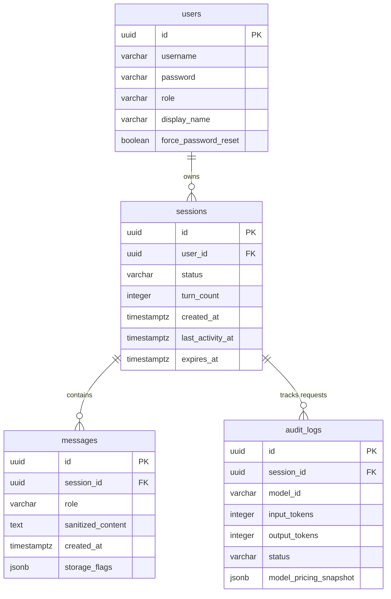

# Design — Chat History Sidebar

## Overview

This feature adds a **chat history sidebar** to the existing SPA (`public/index.html`) and the corresponding backend endpoints to list, inspect, and resume past sessions. It integrates with the existing cost bar so that per-session token and cost statistics are visible both in sidebar rows and in the cost bar when viewing a past session.

### Layered Approach

```
┌─────────────────────────────────────────────────┐
│  public/index.html  (SPA — sidebar + cost bar)  │  ← Frontend (vanilla JS)
├─────────────────────────────────────────────────┤
│  GET /api/v1/sessions                            │
│  GET /api/v1/sessions/:id/messages               │  ← New REST endpoints
│  GET /api/v1/sessions/:id/stats                  │
│  POST /api/v1/sessions/:id/resume                │
├─────────────────────────────────────────────────┤
│  src/routes/session.routes.ts                    │  ← New router
│  src/services/session.service.ts  (extended)     │  ← Extended service
│  src/services/audit.service.ts   (modified)      │  ← Pricing snapshot
├─────────────────────────────────────────────────┤
│  PostgreSQL: sessions, messages, audit_logs      │  ← Existing tables
│  Migration 006: model_pricing_snapshot JSONB     │  ← New column only
└─────────────────────────────────────────────────┘
```

### What's New vs What's Modified

| Layer | New | Modified |
|---|---|---|
| **Routes** | `src/routes/session.routes.ts` | `src/app.ts` (mount new router) |
| **Services** | — | `src/services/session.service.ts` (+4 functions), `src/services/audit.service.ts` (pricing snapshot) |
| **Types** | — | `src/types/audit.types.ts` (+1 field), `src/types/session.types.ts` (+2 interfaces) |
| **DB** | `migrations/006_audit_pricing_snapshot.sql` | — |
| **Config** | — | `src/config/index.ts` (+1 session config) |
| **Frontend** | — | `public/index.html` (sidebar CSS + HTML + ~200 lines JS) |
| **Tests** | `tests/unit/session-stats.test.ts`, `tests/integration/session-routes.test.ts` | `tests/unit/audit.test.ts` (snapshot test) |

---

## Architecture

### Sequence: View Past Session



### Sequence: Resume Session



### Sequence: New Chat (Existing Button + Sidebar Refresh)



### Entity-Relationship (Relevant Subset)



---

## Components and Interfaces

### 1. New Router — `src/routes/session.routes.ts`

All endpoints are gated by `authMiddleware`. No `forcePasswordResetMiddleware` — users with forced password reset can still browse their own history.

```typescript
import { Router } from 'express';
import { authMiddleware } from '../middleware/auth.middleware.js';

const sessionRouter = Router();
sessionRouter.use(authMiddleware);

// GET /api/v1/sessions — list sessions with pagination + stats
sessionRouter.get('/', handleListSessions);

// GET /api/v1/sessions/:id/messages — get full message history
sessionRouter.get('/:id/messages', handleGetSessionMessages);

// GET /api/v1/sessions/:id/stats — get per-session token/cost stats
sessionRouter.get('/:id/stats', handleGetSessionStats);

// POST /api/v1/sessions/:id/resume — reactivate an inactive session
sessionRouter.post('/:id/resume', handleResumeSession);

export { sessionRouter };
```

#### Handler Signatures

```typescript
// GET /
async function handleListSessions(req: Request, res: Response): Promise<void>
// Query params: page? (default 1), pageSize? (default 50, max 100)
// Response: 200 { sessions: SessionWithStats[], total, page, pageSize, hasMore }

// GET /:id/messages
async function handleGetSessionMessages(req: Request, res: Response): Promise<void>
// Response: 200 { session: Session, messages: Message[] } | 404

// GET /:id/stats
async function handleGetSessionStats(req: Request, res: Response): Promise<void>
// Response: 200 SessionStats | 404

// POST /:id/resume
async function handleResumeSession(req: Request, res: Response): Promise<void>
// Response: 200 { session: Session } | 400 | 404
```

### 2. Extended Service — `src/services/session.service.ts`

Four new exported functions added to the existing service:

```typescript
// ── New functions ──

/** Sweep expired sessions for a user (UPDATE status = 'expired'). */
export async function sweepExpiredSessions(userId: string): Promise<void>;

/** List sessions for a user with preview text and aggregated token stats. */
export async function listUserSessions(
  userId: string,
  page: number,
  pageSize: number,
): Promise<{ sessions: SessionWithStats[]; total: number }>;

/** Get aggregated token/cost statistics for a session from audit_logs. */
export async function getSessionStats(sessionId: string): Promise<SessionStats | null>;

/** Resume (reactivate) an inactive session. */
export async function resumeSession(
  userId: string,
  sessionId: string,
): Promise<Session>;
```

#### New Interfaces in `src/types/session.types.ts`

```typescript
export interface SessionWithStats extends Session {
  preview: string | null;        // First user message truncated to 60 chars
  totalInputTokens: number;      // SUM from audit_logs (success only)
  totalOutputTokens: number;
  requestCount: number;
}

export interface SessionStats {
  sessionId: string;
  totalInputTokens: number;
  totalOutputTokens: number;
  requestCount: number;
  estimatedCostUsd: number | null; // null if pricing snapshot unavailable
  breakdown: ModelBreakdown[];
}

export interface ModelBreakdown {
  modelId: string;
  inputTokens: number;
  outputTokens: number;
  requestCount: number;
  estimatedCostUsd: number | null;
}
```

### 3. Modified Audit Service — `src/services/audit.service.ts`

The `log()` method gains pricing snapshot behavior:

```typescript
class AuditService {
  private pricingCache: PricingConfigFile | null = null;
  private pricingCacheLoaded = false;

  /** Load pricing config (lazy, cached, never throws). */
  private getPricingSnapshot(modelId: string): object | null {
    if (!this.pricingCacheLoaded) {
      try {
        const configPath = join(__dirname, '..', 'frontend', 'pricing-config.json');
        this.pricingCache = JSON.parse(readFileSync(configPath, 'utf-8'));
      } catch { /* fire-and-forget */ }
      this.pricingCacheLoaded = true;
    }
    const modelPricing = this.pricingCache?.models[modelId];
    if (!modelPricing) return null;
    return {
      inputPricePer1MTokens: modelPricing.inputPricePer1MTokens,
      outputPricePer1MTokens: modelPricing.outputPricePer1MTokens,
    };
  }

  async log(entry: AuditEntry): Promise<void> {
    const snapshot = entry.status === 'success'
      ? this.getPricingSnapshot(entry.modelId)
      : null;
    // ... INSERT with model_pricing_snapshot column
  }
}
```

### 4. Mounting in `src/app.ts`

```typescript
import { sessionRouter } from './routes/session.routes.js';
// ... existing imports ...

// Mounted after existing inference routes
app.use('/api/v1/sessions', sessionRouter);
```

---

## Data Models

### Migration: `migrations/006_audit_pricing_snapshot.sql`

```sql
-- Migration: 006_audit_pricing_snapshot.sql
-- Description: Add model pricing snapshot column to audit_logs for historical cost accuracy.

ALTER TABLE audit_logs
  ADD COLUMN model_pricing_snapshot JSONB;

COMMENT ON COLUMN audit_logs.model_pricing_snapshot IS
  'Model pricing at request time: { inputPricePer1MTokens, outputPricePer1MTokens }. NULL for failed requests or pre-migration rows.';
```

No index needed — the column is only read in per-session aggregate queries filtered by `session_id` (which already has an index via `idx_audit_logs_timestamp` — actually, let me check). Looking at the migrations, there's no explicit `session_id` index on `audit_logs`. Let's add one:

```sql
CREATE INDEX idx_audit_logs_session_id ON audit_logs(session_id)
  WHERE status = 'success';
```

This partial index covers the session stats query efficiently.

### Key SQL Queries

#### Session List (with preview + stats)

```sql
-- 1. Sweep expired sessions
UPDATE sessions SET status = 'expired'
WHERE user_id = $1 AND expires_at <= NOW() AND status != 'expired';

-- 2. Count total
SELECT COUNT(*)::integer FROM sessions WHERE user_id = $1;

-- 3. Fetch page with lateral joins
SELECT
  s.id, s.status, s.turn_count,
  s.created_at, s.updated_at, s.last_activity_at, s.expires_at,
  s.user_id,
  -- Preview: first user message
  LEFT(COALESCE(pv.sanitized_content, ''), 60) AS preview,
  -- Stats: aggregated from audit_logs
  COALESCE(st.total_input_tokens, 0)  AS total_input_tokens,
  COALESCE(st.total_output_tokens, 0) AS total_output_tokens,
  COALESCE(st.request_count, 0)       AS request_count
FROM sessions s
LEFT JOIN LATERAL (
  SELECT sanitized_content
  FROM messages
  WHERE session_id = s.id AND role = 'user'
  ORDER BY created_at ASC, id ASC
  LIMIT 1
) pv ON true
LEFT JOIN LATERAL (
  SELECT
    COALESCE(SUM(input_tokens), 0)  AS total_input_tokens,
    COALESCE(SUM(output_tokens), 0) AS total_output_tokens,
    COUNT(*)::integer                AS request_count
  FROM audit_logs
  WHERE session_id = s.id AND status = 'success'
) st ON true
WHERE s.user_id = $2
ORDER BY s.last_activity_at DESC
LIMIT $3 OFFSET $4;
```

#### Session Stats (per-model breakdown)

```sql
SELECT
  model_id,
  SUM(input_tokens)  AS input_tokens,
  SUM(output_tokens) AS output_tokens,
  COUNT(*)::integer  AS request_count,
  model_pricing_snapshot
FROM audit_logs
WHERE session_id = $1 AND status = 'success'
GROUP BY model_id, model_pricing_snapshot;
```

The service layer then computes `estimatedCostUsd` per model from `model_pricing_snapshot` JSON.

#### Resume Session (transaction)

```sql
BEGIN;
  -- Deactivate current active session (if any)
  UPDATE sessions SET status = 'inactive', updated_at = NOW()
  WHERE user_id = $1 AND status = 'active';

  -- Reactivate target session
  UPDATE sessions
  SET status = 'active',
      last_activity_at = NOW(),
      expires_at = NOW() + INTERVAL '1 hour' * $2,
      updated_at = NOW()
  WHERE id = $3 AND user_id = $1
  RETURNING *;
COMMIT;
```

---

## Configuration

### New Environment Variable

| Variable | Default | Description |
|---|---|---|
| `SESSION_LIST_PAGE_SIZE` | `50` | Default page size for session list endpoint |

Added to `src/config/index.ts` under `session`:

```typescript
session: {
  // ... existing ...
  listPageSize: parseInt(process.env.SESSION_LIST_PAGE_SIZE || '50', 10),
},
```

No other new configuration is required. The existing `SESSION_EXPIRY_HOURS` controls the expiry window for resumed sessions.

---

## Frontend Design

### Layout

```
┌──────────────────────────────────────────────────────────────┐
│  Header: [logo]         [New Chat] [👤 User] [Logout]        │
├────────────┬─────────────────────────────────────────────────┤
│            │  Cost Bar: Session Rp X | Current Rp Y | ...    │
│  Sidebar   ├─────────────────────────────────────────────────┤
│  ┌───────┐ │                                                 │
│  │📝 S1  │ │  Chat Area                                      │
│  │📝 S2  │ │  ┌─────────────────────────────────────────┐   │
│  │📝 S3  │ │  │ User: ...                                │   │
│  │📝 S4  │ │  │ Assistant: ...                           │   │
│  │📝 S5  │ │  └─────────────────────────────────────────┘   │
│  │Load   │ │                                                 │
│  │more   │ │  ┌─────────────────────────────────────────┐   │
│  └───────┘ │  │ Input Area (disabled when viewing past)  │   │
│  280px     │  └─────────────────────────────────────────┘   │
│            │                    flex: 1                      │
└────────────┴─────────────────────────────────────────────────┘
```

### Sidebar DOM Structure

```html
<aside class="sidebar" id="sidebar">
  <div class="sidebar-header">
    <span class="sidebar-title">Conversations</span>
    <button class="sidebar-toggle" onclick="toggleSidebar()" title="Toggle sidebar">☰</button>
  </div>
  <div class="sidebar-list" id="sidebar-list">
    <!-- Populated by JS -->
  </div>
  <div class="sidebar-footer" id="sidebar-footer">
    <button class="load-more-btn" id="load-more-btn" style="display:none" onclick="loadMoreSessions()">
      Load more
    </button>
    <div class="sidebar-error" id="sidebar-error" style="display:none">
      Failed to load conversations. <button onclick="loadSessions()">Retry</button>
    </div>
  </div>
</aside>
```

### Sidebar Row Template

Each session row is a `<div class="session-row">`:

```html
<div class="session-row active" data-session-id="uuid" onclick="viewSession('uuid')">
  <div class="session-row-preview">How do I transfer money to another bank account…</div>
  <div class="session-row-meta">
    <span class="session-row-time">2 hours ago</span>
    <span class="session-row-turns">5 turns</span>
    <span class="session-row-tokens">15.7K tokens</span>
    <span class="session-row-cost">Rp 12.50</span>
  </div>
  <div class="session-row-status degraded" title="Some messages may be missing">⚠️</div>
</div>
```

### Frontend State Additions

```javascript
// New state variables (add to existing <script> block)
let sessionList = [];               // Array of SessionWithStats
let currentViewingSessionId = null; // Session ID being viewed (null = active session)
let savedSessionCost = 0;           // Persisted cost from GET /:id/stats (USD)
let savedSessionTokens = { in: 0, out: 0, requests: 0 }; // Persisted stats
let sessionPage = 1;
let sessionHasMore = false;
let isLoadingSessions = false;
let sidebarCollapsed = false;       // Mobile toggle state
```

### Cost Bar Update Logic

```javascript
// Replaces the current in-memory-only approach with session-awareness
function updateCostBar() {
  if (currentViewingSessionId && currentViewingSessionId !== currentSessionId) {
    // Viewing a past session → show persisted stats
    document.getElementById('session-cost').textContent = formatCost(savedSessionCost);
    document.getElementById('current-cost').textContent = formatCost(0);
    document.getElementById('tokens-in').textContent = savedSessionTokens.in.toLocaleString();
    document.getElementById('tokens-out').textContent = savedSessionTokens.out.toLocaleString();
    document.getElementById('request-count').textContent = savedSessionTokens.requests;
  } else if (currentSessionId) {
    // Active session → show live in-memory stats + saved baseline
    const totalCost = savedSessionCost + sessionTotal;
    document.getElementById('session-cost').textContent = formatCost(totalCost);
    // current-cost, tokens-in/out still update via SSE metadata events
    document.getElementById('request-count').textContent = savedSessionTokens.requests + sessionCosts.length;
  } else {
    // No session → all zeros
    resetCostBar();
  }
}
```

### CSS Additions (Key Classes)

```css
/* Sidebar layout */
#chat-screen { flex-direction: row; }  /* changed from column */
.sidebar {
  width: 280px;
  min-width: 280px;
  background: var(--bg-secondary);
  border-right: 1px solid var(--border);
  display: flex;
  flex-direction: column;
  height: 100vh;
  overflow: hidden;
}
.chat-main {
  flex: 1;
  display: flex;
  flex-direction: column;
  height: 100vh;
  min-width: 0;  /* prevent flex overflow */
}
.sidebar.collapsed { min-width: 0; width: 0; padding: 0; border: none; }

/* Session rows */
.session-row {
  padding: 0.75rem 1rem;
  border-bottom: 1px solid var(--border);
  cursor: pointer;
  transition: background 0.15s;
}
.session-row:hover { background: var(--bg-tertiary); }
.session-row.active { border-left: 3px solid var(--accent); background: rgba(181,228,247,0.05); }

/* Responsive: sidebar collapses on mobile */
@media (max-width: 768px) {
  #chat-screen { flex-direction: column; }
  .sidebar { width: 100%; min-width: 100%; max-height: 40vh; }
  .sidebar.collapsed { max-height: 0; min-height: 0; }
}
```

---

## Correctness Properties

These are properties the implementation must uphold — candidates for property-based testing.

| # | Property | Verification |
|---|---|---|
| CP1 | **Ownership isolation**: `GET /sessions/:id/*` and `POST /sessions/:id/resume` never return data for a session owned by a different user. | Integration test: user A's token against user B's session ID → 404 |
| CP2 | **Single active session**: After `POST /sessions/:id/resume`, at most one session per user has `status = 'active'`. | Property test: run concurrent resumes, query `SELECT COUNT(*) FROM sessions WHERE user_id=$1 AND status='active'` → ≤ 1 |
| CP3 | **Expiry sweep idempotency**: Running the expiry sweep multiple times produces the same state. | Unit test: two consecutive sweeps → same row count updated |
| CP4 | **Pagination stability**: `page=1&pageSize=10` followed by `page=2&pageSize=10` returns disjoint sets with no gaps or duplicates (assuming no concurrent mutations). | Integration test: create 25 sessions, paginate through all, collect IDs → all unique, count = 25 |
| CP5 | **Preview is always first user message**: The `preview` field returns the chronologically first `role='user'` message in each session. | Unit test: insert messages out of order, verify preview matches earliest |
| CP6 | **Stats consistency**: `SUM(breakdown.inputTokens)` across all models equals `totalInputTokens` in the stats response. | Unit test: mock audit_logs rows, verify aggregation |
| CP7 | **Resumed session expiry refresh**: After resume, `expires_at` ≥ `NOW() + expiryHours - 1 second` (allowing for clock skew). | Integration test |
| CP8 | **Cost bar state correctness**: When `currentViewingSessionId === null`, cost bar shows in-memory values. When set to a past session, it shows persisted values. When set to the resumed session, it shows saved + live. | Integration test: mock states, verify DOM content |
| CP9 | **No N+1 on list**: The session list query issues at most 3 SQL statements (expiry sweep, count, fetch) regardless of session count. | Unit test: spy on `query()` calls |

---

## Error Handling

| Scenario | HTTP Status | System Behaviour | User Impact |
|---|---|---|---|
| Session not found | `404` | Return `{ error: "SESSION_NOT_FOUND" }` | Error shown in chat area |
| Session belongs to other user | `404` | Same as not found (no info leak) | Error shown in chat area |
| Resume expired session | `400` | Return `{ error: "SESSION_EXPIRED", message: "Cannot resume an expired session" }` | Toast notification |
| Resume already-active session | `200` | Return session as-is (idempotent) | No visible change |
| Database query failure | `500` | Log full error server-side, return sanitized `{ error: "INTERNAL_ERROR" }` | Generic error in sidebar or chat area |
| Stats endpoint — no audit logs | `200` | Return stats with all zeros and empty breakdown | Cost bar shows `Rp 0.00`, `0 / 0` tokens |
| Frontend — session list fetch fails | N/A | Sidebar shows error banner with Retry button | Sidebar unusable until retry succeeds |
| Frontend — stats fetch fails | N/A | Cost bar falls back to in-memory values | Cost bar shows active-session data (graceful degradation) |
| Pricing config file missing | N/A | `model_pricing_snapshot` written as `NULL`; `estimatedCostUsd` returns `null` | Cost shown as "—" in stats |
| Unknown model in pricing snapshot | N/A | `estimatedCostUsd` returns `null` for that breakdown row | Partial cost in breakdown |

---

## Testing Strategy

### Unit Tests (`tests/unit/`)

| Test File | What It Covers |
|---|---|
| `session-stats.test.ts` | `getSessionStats()` — aggregation logic, per-model breakdown computation, null pricing handling, zero-row edge case |
| `session-list.test.ts` | `listUserSessions()` — pagination math, preview truncation, expiry sweep SQL correctness |
| `audit-snapshot.test.ts` | `getPricingSnapshot()` — cache hit/miss, missing config file, unknown model → null |
| `cost-bar.test.ts` (new) | `updateCostBar()` logic — state transitions between active/past/no session |

### Property-Based Tests (`tests/property/`)

| Test File | What It Covers |
|---|---|
| `session-pagination.test.ts` | CP4 — generate N sessions with random timestamps, paginate in different page sizes, verify total count and no duplicates |
| `session-resume-concurrency.test.ts` | CP2 — concurrent resume attempts on different sessions for same user, verify exactly one active session |

### Integration Tests (`tests/integration/`)

| Test File | What It Covers |
|---|---|
| `session-routes.test.ts` | Full HTTP flow: list sessions (paginated), get messages, get stats, resume, 404 for foreign session, 400 for expired resume. Auth gating (401 without token). |
| `session-cost-bar.test.ts` | End-to-end: create session → send requests → verify stats endpoint returns correct totals → resume → verify expiry refreshed |

### Test Data Setup

Integration tests use the existing test database with seeded data:
1. Create user A with 3 sessions (varying statuses, turn counts, message counts)
2. Create user B with 1 session (for ownership isolation tests)
3. Insert audit_log rows with varying token counts and pricing snapshots
4. Insert messages for each session (for preview verification)
