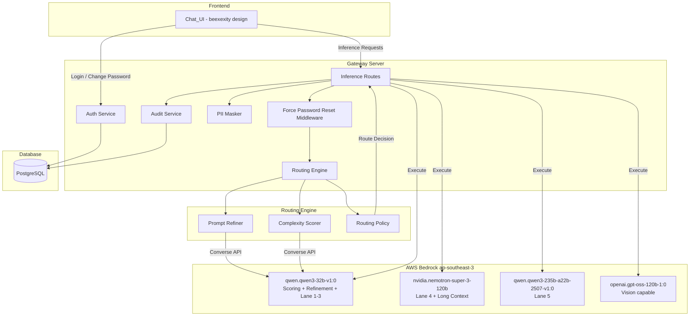
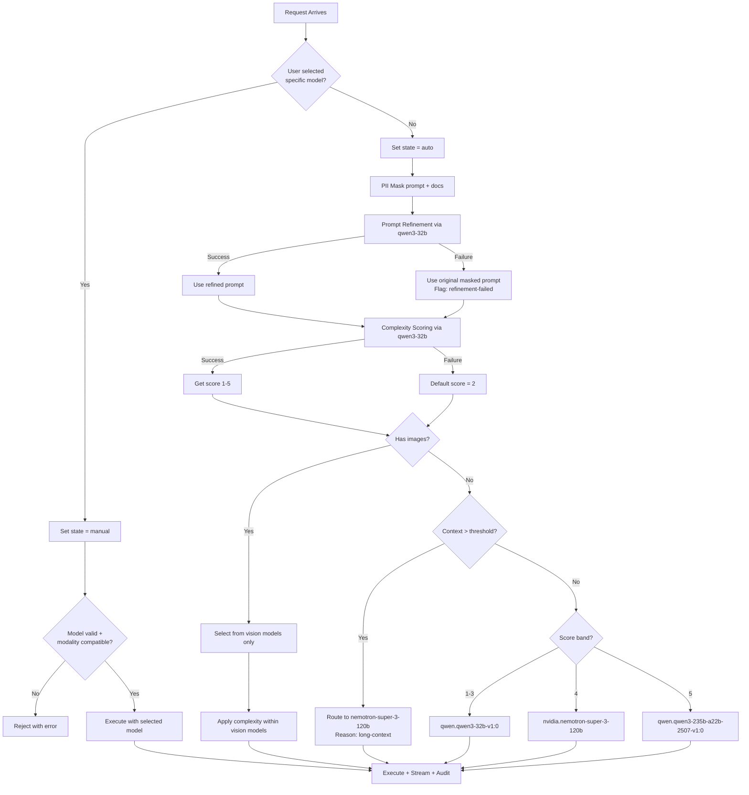
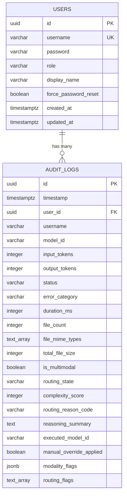
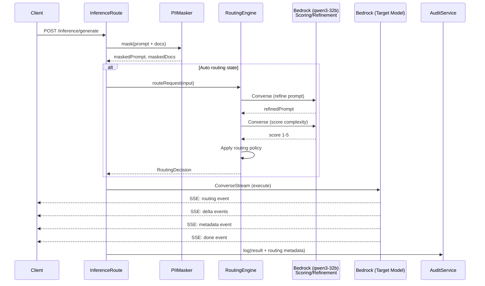
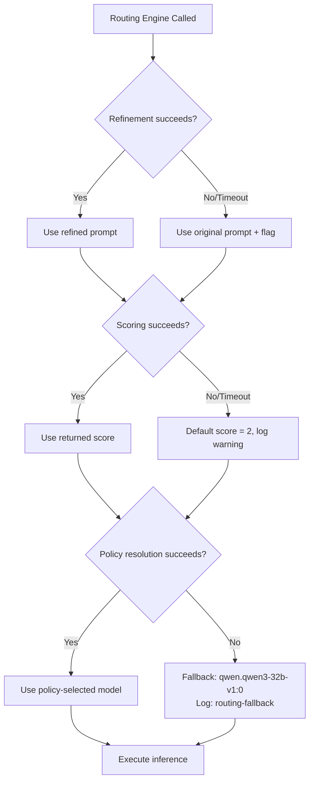

# Design Document: Gateway Enhancements

## Overview

This design covers four areas of enhancement to the Unified Inference Gateway:

1. **Force Password Reset on First Login** — Adds a `force_password_reset` flag to the users table and a new `/auth/change-password` endpoint that must be completed before any other API access.
2. **UI Overhaul** — Replaces the existing Chat_UI with the beexexity design language (dark theme, new layout, gradient branding, reorganized input area).
3. **Remove DeepSeek V3** — Eliminates `deepseek.v3-v1:0` from all model arrays, capabilities registry, and routing paths.
4. **Routing Engine** — Implements server-side prompt refinement and complexity scoring using `qwen.qwen3-32b-v1:0` via Bedrock Converse API, with policy-based auto-routing, long-context awareness, multimodal-aware routing, and operational fallbacks.

All changes remain within the existing constraints: ap-southeast-3 region, PII masking before all model invocations, audit logging, and JWT-based authentication.

## Architecture

### High-Level System Architecture



### Routing Engine Flow



## Components and Interfaces

### 1. Auth Service Extensions

```typescript
// src/types/auth.types.ts — Extended interfaces

export interface LoginResult {
  token?: string;                    // Only present when no reset required
  expiresIn?: number;
  user: UserProfile;
  requiresPasswordReset?: boolean;   // true when First_Login_Flag is set
  resetToken?: string;               // Short-lived token for password change only
}

export interface UserProfile {
  id: string;
  username: string;
  role: 'admin' | 'user';
  displayName: string;
  createdAt: string;
  updatedAt: string;
  forcePasswordReset: boolean;       // Exposed to client
}

export interface ChangePasswordDto {
  currentPassword: string;
  newPassword: string;
}

export interface ChangePasswordResult {
  token: string;
  expiresIn: number;
  user: UserProfile;
}
```

```typescript
// src/services/auth.service.ts — New exports

export async function changePassword(
  userId: string,
  currentPassword: string,
  newPassword: string
): Promise<ChangePasswordResult>;
```

```typescript
// src/routes/auth.routes.ts — New endpoint

// POST /api/v1/auth/change-password
// Body: { currentPassword: string, newPassword: string }
// Auth: Bearer token (including reset tokens)
// Returns: ChangePasswordResult on success, 401/400 on failure
```

### 2. Force Password Reset Middleware

```typescript
// src/middleware/password-reset.middleware.ts

import { Request, Response, NextFunction } from 'express';

/**
 * Middleware that checks if the authenticated user has force_password_reset = true.
 * If so, rejects the request with 403 unless the route is the change-password endpoint.
 * Applied AFTER authMiddleware on protected routes.
 */
export function forcePasswordResetMiddleware(
  req: Request,
  res: Response,
  next: NextFunction
): void;
```

### 3. Routing Engine Service

```typescript
// src/services/routing-engine.service.ts

export interface RoutingInput {
  originalPrompt: string;           // Already PII-masked
  maskedDocumentText?: string;      // Extracted + masked doc text
  hasImages: boolean;
  imageModelRequired: boolean;
  routingState: 'auto' | 'manual';
  manualModelId?: string;           // Set when routingState = 'manual'
  userId: string;
}

export interface RoutingDecision {
  executedModelId: string;
  routingState: 'auto' | 'manual';
  complexityScore: number;          // 1-5
  scoreBand: 'direct-answer' | 'stronger-reasoning' | 'advanced-reasoning';
  confidence: number;               // 0.0-1.0
  refinedPrompt: string;            // The refined or original prompt
  routingReasonCode: string;        // e.g. 'complexity-band-1-3', 'long-context', 'vision-required'
  reasoningSummary: string;         // Human-readable summary
  modalityFlags: ModalityFlags;
  manualOverrideApplied: boolean;
  flags: string[];                  // e.g. ['refinement-failed']
}

export interface ModalityFlags {
  textOnly: boolean;
  documentText: boolean;
  image: boolean;
  mixed: boolean;
}

export interface RoutingEngineConfig {
  longContextThreshold: number;     // Token count threshold (default: 8000)
  scoringTimeoutMs: number;         // Timeout for scoring call (default: 5000)
  refinementTimeoutMs: number;      // Timeout for refinement call (default: 8000)
  defaultFallbackScore: number;     // Default on scoring failure (default: 2)
  routingMetadataEnabled: boolean;  // Whether to emit routing SSE event
}

/**
 * Main entry point for the routing engine.
 * Performs prompt refinement, complexity scoring, and policy-based routing.
 */
export async function routeRequest(input: RoutingInput): Promise<RoutingDecision>;

/**
 * Refines the prompt using qwen.qwen3-32b-v1:0 via Bedrock Converse (non-streaming).
 * Returns the refined prompt or null on failure.
 */
export async function refinePrompt(
  originalPrompt: string,
  documentContext?: string
): Promise<string | null>;

/**
 * Scores prompt complexity 1-5 using qwen.qwen3-32b-v1:0 via Bedrock Converse (non-streaming).
 * Returns score object or null on failure.
 */
export async function scoreComplexity(
  prompt: string,
  documentContext?: string
): Promise<{ score: number; confidence: number } | null>;
```

### 4. Routing Policy Module

```typescript
// src/services/routing-policy.service.ts

export interface PolicyInput {
  complexityScore: number;
  hasImages: boolean;
  isLongContext: boolean;
  routingState: 'auto' | 'manual';
  manualModelId?: string;
}

export interface PolicyResult {
  modelId: string;
  reasonCode: string;
}

/**
 * Applies text-only routing policy based on complexity score bands.
 * Score 1-3 → qwen.qwen3-32b-v1:0
 * Score 4   → nvidia.nemotron-super-3-120b
 * Score 5   → qwen.qwen3-235b-a22b-2507-v1:0
 */
export function applyTextPolicy(score: number): PolicyResult;

/**
 * Applies vision-aware routing when images are present.
 * Selects from vision-capable models only.
 */
export function applyVisionPolicy(score: number): PolicyResult;

/**
 * Applies long-context override when input exceeds threshold.
 * Prefers nvidia.nemotron-super-3-120b for its 1M context support.
 */
export function applyLongContextPolicy(): PolicyResult;

/**
 * Top-level policy dispatcher.
 */
export function resolvePolicy(input: PolicyInput): PolicyResult;
```

### 5. Updated Inference Types

```typescript
// src/types/inference.types.ts — Updated

export const ALLOWED_MODELS = [
  'nvidia.nemotron-super-3-120b',
  'openai.gpt-oss-120b-1:0',
  'qwen.qwen3-235b-a22b-2507-v1:0',
  'qwen.qwen3-32b-v1:0',
  // deepseek.v3-v1:0 REMOVED
] as const;

export type AllowedModelId = typeof ALLOWED_MODELS[number];

export const DEFAULT_MODEL: AllowedModelId = 'qwen.qwen3-32b-v1:0';

export interface InferenceRequest {
  maskedPrompt: string;
  modelId: string;
  userId: string;
  inferenceConfig?: {
    maxTokens?: number;
    temperature?: number;
    topP?: number;
  };
  contentBlocks?: ContentBlock[];
  routingDecision?: RoutingDecision;  // Attached by routing engine
}

export interface RoutingMetadataEvent {
  refinedPrompt?: string;
  complexityScore?: number;
  scoreBand?: string;
  routingState: 'auto' | 'manual';
  executedModelId: string;
  routingReasonCode: string;
  reasoningSummary: string;
  modalityFlags?: ModalityFlags;
  manualOverrideApplied: boolean;
}
```

### 6. Configuration Extensions

```typescript
// src/config/index.ts — Extended

export const config = {
  // ... existing config ...
  routing: {
    longContextThreshold: parseInt(
      process.env.ROUTING_LONG_CONTEXT_THRESHOLD || '8000', 10
    ),
    scoringTimeoutMs: parseInt(
      process.env.ROUTING_SCORING_TIMEOUT_MS || '5000', 10
    ),
    refinementTimeoutMs: parseInt(
      process.env.ROUTING_REFINEMENT_TIMEOUT_MS || '8000', 10
    ),
    defaultFallbackScore: parseInt(
      process.env.ROUTING_DEFAULT_FALLBACK_SCORE || '2', 10
    ),
    metadataEnabled: process.env.ROUTING_METADATA_ENABLED !== 'false',
    transparencyEnabled: process.env.ROUTING_TRANSPARENCY_ENABLED === 'true',
    scoringModelId: 'qwen.qwen3-32b-v1:0',  // Lightweight model for scoring/refinement
  },
  auth: {
    minPasswordLength: parseInt(process.env.MIN_PASSWORD_LENGTH || '8', 10),
    resetTokenExpiresIn: 300, // 5 minutes for password reset token
  },
} as const;
```

## Data Models

### Database Schema Changes (Migration 003)

```sql
-- Migration: 003_gateway_enhancements.sql

-- 1. Add force_password_reset flag to users table
ALTER TABLE users ADD COLUMN force_password_reset BOOLEAN NOT NULL DEFAULT TRUE;

-- Set existing users to false (they don't need forced reset)
UPDATE users SET force_password_reset = FALSE WHERE force_password_reset = TRUE;

-- 2. Add routing metadata columns to audit_logs
ALTER TABLE audit_logs ADD COLUMN routing_state VARCHAR(16);
ALTER TABLE audit_logs ADD COLUMN complexity_score INTEGER;
ALTER TABLE audit_logs ADD COLUMN routing_reason_code VARCHAR(64);
ALTER TABLE audit_logs ADD COLUMN reasoning_summary TEXT;
ALTER TABLE audit_logs ADD COLUMN executed_model_id VARCHAR(128);
ALTER TABLE audit_logs ADD COLUMN manual_override_applied BOOLEAN DEFAULT FALSE;
ALTER TABLE audit_logs ADD COLUMN modality_flags JSONB;
ALTER TABLE audit_logs ADD COLUMN routing_flags TEXT[];

-- 3. Index for routing analysis queries
CREATE INDEX idx_audit_logs_routing_state ON audit_logs(routing_state);
CREATE INDEX idx_audit_logs_complexity_score ON audit_logs(complexity_score);
```

### Entity Relationship Diagram



### Routing Engine Internal Data Flow




## Correctness Properties

*A property is a characteristic or behavior that should hold true across all valid executions of a system — essentially, a formal statement about what the system should do. Properties serve as the bridge between human-readable specifications and machine-verifiable correctness guarantees.*

### Property 1: User creation sets force_password_reset flag

*For any* valid CreateUserDto, after the user is successfully created, the resulting user record SHALL have `force_password_reset = true`.

**Validates: Requirements 1.1**

### Property 2: Login with reset flag returns reset-required response

*For any* user whose `force_password_reset` is `true`, authenticating with valid credentials SHALL return a response with `requiresPasswordReset = true` and SHALL NOT include a standard session token.

**Validates: Requirements 1.2**

### Property 3: Force password reset blocks protected API access

*For any* user with `force_password_reset = true` and any protected API route (excluding auth endpoints), the gateway SHALL respond with HTTP 403.

**Validates: Requirements 1.3**

### Property 4: Valid password change round-trip

*For any* user with `force_password_reset = true` and a valid password change (correct current password, new password ≥ 8 chars, new ≠ current), after the change: the flag SHALL be `false`, the new password SHALL authenticate successfully, and a valid JWT SHALL be returned.

**Validates: Requirements 1.5**

### Property 5: Password validation rejects invalid inputs

*For any* password change request where the new password equals the current password OR has length < 8 characters, the request SHALL be rejected with a validation error.

**Validates: Requirements 1.6, 1.7**

### Property 6: Incorrect current password in change request is rejected

*For any* password change request where the provided current password does not match the stored hash, the request SHALL be rejected with HTTP 401.

**Validates: Requirements 1.8**

### Property 7: Routing never selects DeepSeek V3

*For any* valid RoutingInput (regardless of complexity score, modality, or routing state), the RoutingDecision.executedModelId SHALL never be `deepseek.v3-v1:0`.

**Validates: Requirements 3.5**

### Property 8: Auto routing produces refined prompt or failure flag

*For any* RoutingInput with `routingState = 'auto'`, the RoutingDecision SHALL contain either a non-empty `refinedPrompt` different from the original, OR the `flags` array SHALL include `'refinement-failed'` with `refinedPrompt` equal to the original masked prompt.

**Validates: Requirements 4.1, 4.4**

### Property 9: Complexity score range invariant

*For any* RoutingInput with `routingState = 'auto'`, the RoutingDecision.complexityScore SHALL be an integer in the range [1, 5].

**Validates: Requirements 5.1**

### Property 10: Score-to-band mapping correctness

*For any* complexity score in [1, 5], the score band SHALL be mapped as: scores 1-3 → `'direct-answer'`, score 4 → `'stronger-reasoning'`, score 5 → `'advanced-reasoning'`.

**Validates: Requirements 5.3**

### Property 11: Scoring failure defaults to score 2

*For any* RoutingInput where the complexity scoring subprocess fails (throws or returns null), the RoutingDecision.complexityScore SHALL default to 2.

**Validates: Requirements 5.5**

### Property 12: No model selection implies auto state

*For any* inference request where no explicit modelId is provided (or the default/auto option is selected), the resolved routingState SHALL be `'auto'`.

**Validates: Requirements 6.2, 6.3**

### Property 13: Explicit model selection implies manual state

*For any* inference request where a specific valid modelId is provided by the user, the resolved routingState SHALL be `'manual'`.

**Validates: Requirements 6.4**

### Property 14: Manual state uses selected model

*For any* RoutingInput with `routingState = 'manual'` and a valid `manualModelId`, the RoutingDecision.executedModelId SHALL equal `manualModelId` and `manualOverrideApplied` SHALL be `true`.

**Validates: Requirements 6.5**

### Property 15: Text-only auto routing follows complexity band policy

*For any* text-only (no images) auto routing request with a given complexity score (and context below long-context threshold): score 1-3 SHALL select `qwen.qwen3-32b-v1:0`, score 4 SHALL select `nvidia.nemotron-super-3-120b`, score 5 SHALL select `qwen.qwen3-235b-a22b-2507-v1:0`.

**Validates: Requirements 7.2, 7.3, 7.4**

### Property 16: Image presence forces vision-capable model

*For any* RoutingInput with `routingState = 'auto'` and `hasImages = true`, the RoutingDecision.executedModelId SHALL be a model with `capability = 'text-and-image'` in the Capability_Registry.

**Validates: Requirements 8.1**

### Property 17: Manual incompatible model with images is rejected

*For any* RoutingInput with `routingState = 'manual'`, `hasImages = true`, and `manualModelId` referring to a text-only model, the routing SHALL produce a rejection/error indicating model-modality incompatibility.

**Validates: Requirements 8.2**

### Property 18: Documents without images use text routing

*For any* RoutingInput with non-empty `maskedDocumentText` but `hasImages = false`, the routing SHALL follow text-only policy (not vision policy) and `modalityFlags.image` SHALL be `false`.

**Validates: Requirements 8.3**

### Property 19: Long context overrides to nemotron with reason code

*For any* text-only auto RoutingInput where the total context length exceeds the configured `longContextThreshold`, the RoutingDecision.executedModelId SHALL be `nvidia.nemotron-super-3-120b` and `routingReasonCode` SHALL be `'long-context'`.

**Validates: Requirements 9.1, 9.3**

### Property 20: Manual state overrides long-context preference

*For any* RoutingInput with `routingState = 'manual'` and context exceeding the long-context threshold, the RoutingDecision.executedModelId SHALL still equal the user's `manualModelId` (not overridden by long-context policy).

**Validates: Requirements 9.4**

### Property 21: Reasoning summary is non-empty and references factors

*For any* RoutingDecision, the `reasoningSummary` SHALL be a non-empty string and SHALL reference at least the routing state and one routing factor (complexity band, modality, or long-context).

**Validates: Requirements 10.1, 10.2**

### Property 22: Routing failure falls back to default model without error

*For any* RoutingInput with `routingState = 'auto'` where the routing engine fails (refinement AND scoring both fail, or engine timeout), the system SHALL fall back to `qwen.qwen3-32b-v1:0` as execution model and SHALL NOT return an error to the client.

**Validates: Requirements 12.1, 12.2, 12.4**

## Error Handling

### Error Categories and Responses

| Scenario | HTTP Status | Error Code | User Message | Behavior |
|----------|-------------|------------|--------------|----------|
| Password reset required (API access) | 403 | `PASSWORD_RESET_REQUIRED` | "Password change required before accessing this resource" | Block all non-auth routes |
| Password change — wrong current | 401 | `INVALID_CREDENTIALS` | "Authentication failed" | Generic message, no credential leak |
| Password change — same as current | 400 | `PASSWORD_SAME` | "New password must differ from current password" | Reject with clear message |
| Password change — too short | 400 | `PASSWORD_TOO_SHORT` | "Password must be at least 8 characters" | Reject with clear message |
| DeepSeek V3 model requested | 400 | `INVALID_MODEL` | "Invalid model. Choose from: ..." | Existing validation path |
| Routing engine timeout | — | — | (no error to user) | Fall back to default model, log |
| Prompt refinement failure | — | — | (no error to user) | Use original prompt, flag in metadata |
| Complexity scoring failure | — | — | (no error to user) | Default score = 2, log warning |
| Manual model + images incompatible | 400 | `MODEL_NO_VISION` | "Model does not support image inputs" | Existing rejection path |

### Fallback Strategy



### Timeout Configuration

- Prompt refinement: 8000ms (configurable via `ROUTING_REFINEMENT_TIMEOUT_MS`)
- Complexity scoring: 5000ms (configurable via `ROUTING_SCORING_TIMEOUT_MS`)
- Both use `AbortController` to enforce timeouts on Bedrock Converse calls
- Timeouts trigger graceful fallback, never user-facing errors

### Audit Logging for Routing

All routing decisions (including fallbacks) are logged to `audit_logs` with:
- `routing_state`: 'auto' | 'manual'
- `complexity_score`: 1-5 (or null for manual)
- `routing_reason_code`: e.g., 'complexity-band-1-3', 'long-context', 'vision-required', 'manual-override', 'routing-fallback'
- `reasoning_summary`: human-readable explanation
- `executed_model_id`: the model that actually ran
- `manual_override_applied`: boolean
- `routing_flags`: array of flags like ['refinement-failed', 'scoring-failed']

## Testing Strategy

### Property-Based Testing

This feature is suitable for property-based testing because the routing engine contains pure decision logic with clear input/output behavior, universal properties that hold across wide input spaces, and deterministic policy mappings.

**Library:** `fast-check` (already in devDependencies)
**Configuration:** Minimum 100 iterations per property test
**Tag format:** `Feature: gateway-enhancements, Property {N}: {title}`

Property-based tests will cover:
- Routing policy logic (Properties 7, 9-11, 15-20, 22): Pure functions mapping inputs to model selections
- Password validation logic (Properties 5, 6): Input validation rules
- State determination logic (Properties 12-14): Request classification
- Fallback behavior (Properties 8, 11, 22): Degraded mode correctness

### Unit Tests (Example-Based)

Unit tests focus on specific scenarios and edge cases:
- Auth flow: login with force reset flag, password change success, password change failures
- DeepSeek removal: verify ALLOWED_MODELS, verify MODEL_CAPABILITIES, verify rejection
- Routing metadata SSE event format
- UI: avatar initial derivation, password form display trigger

### Integration Tests

Integration tests verify end-to-end flows:
- Full login → force reset → password change → normal access flow
- Inference request → routing engine → model execution → SSE stream with routing event
- Routing fallback: simulate routing engine timeout, verify request still succeeds
- Backward compatibility: client ignoring routing event continues to work

### Test Organization

```
tests/
├── property/
│   ├── routing-policy.property.test.ts    (Properties 7, 15-20)
│   ├── routing-state.property.test.ts     (Properties 12-14)
│   ├── routing-fallback.property.test.ts  (Properties 8, 9, 11, 22)
│   ├── score-mapping.property.test.ts     (Properties 9, 10)
│   └── password-validation.property.test.ts (Properties 1-6)
├── unit/
│   ├── routing-engine.test.ts
│   ├── routing-policy.test.ts
│   ├── password-reset.middleware.test.ts
│   ├── auth-change-password.test.ts
│   └── deepseek-removal.test.ts
└── integration/
    ├── force-reset-flow.test.ts
    ├── routing-e2e.test.ts
    └── routing-fallback.test.ts
```
