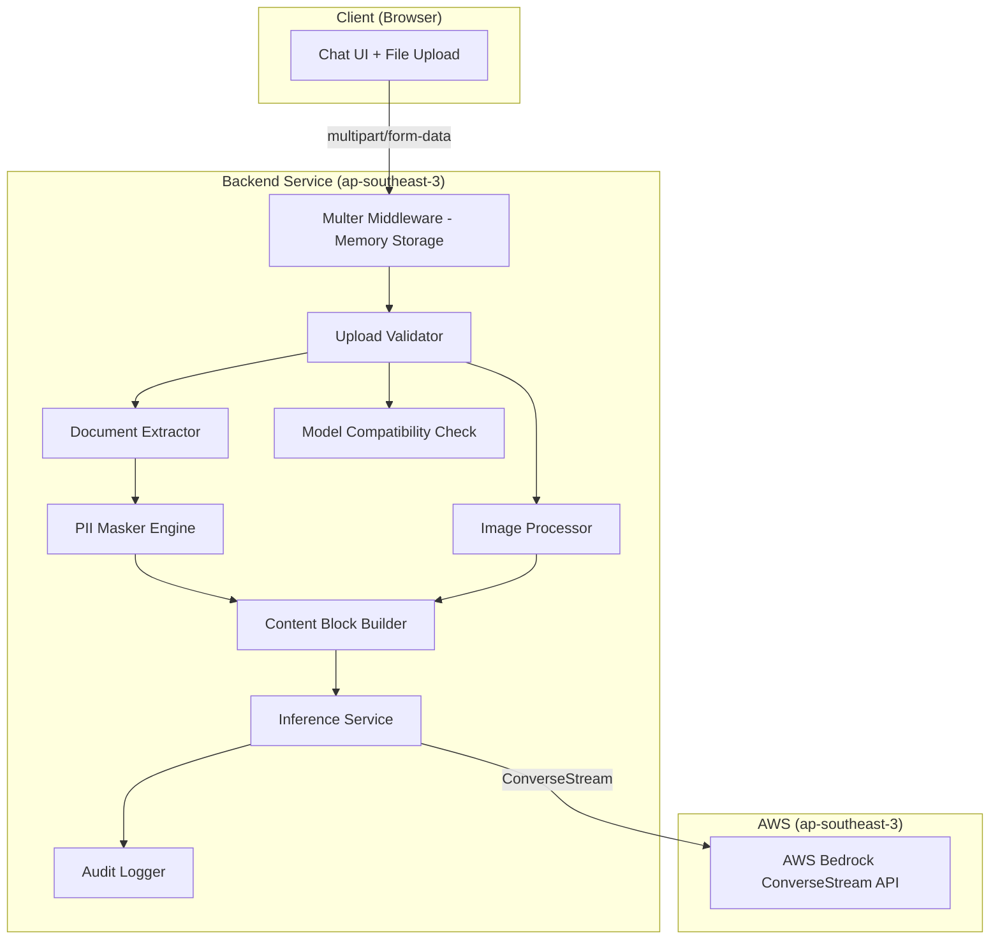
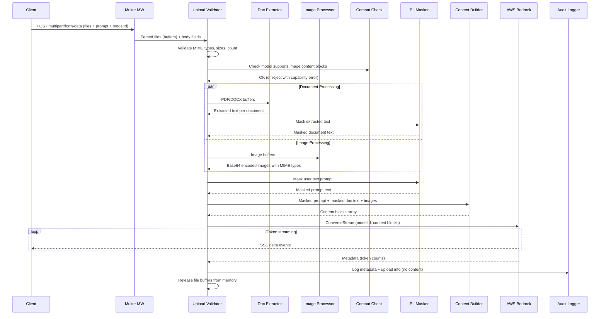

# Design Document: Multimodal Upload Support

## Overview

This feature extends the Unified Inference Gateway to accept document (PDF, DOCX) and image (PNG, JPEG, WEBP) file uploads alongside text prompts. Documents are text-extracted server-side, images are base64-encoded for vision-capable models, and PII masking is applied to all extracted text. All file processing occurs in-memory with no persistent storage, maintaining data residency compliance.

### Key Design Decisions

| Decision | Choice | Rationale |
|----------|--------|-----------|
| File upload library | multer (memory storage) | Mature Express middleware, memory-only storage avoids disk I/O, configurable limits |
| PDF text extraction | pdf-parse | Lightweight, pure-JS PDF text extraction, no native dependencies |
| DOCX text extraction | mammoth | Robust DOCX-to-text extraction, well-maintained, no binary dependencies |
| Image handling | Raw buffer → base64 | Bedrock Converse API accepts base64 image content blocks natively |
| Request format | multipart/form-data (with files), JSON (text-only) | Backward compatible — existing text-only clients continue working unchanged |
| Model capabilities | Static registry in code | Simple, 5 models are fixed for MVP; avoids dynamic discovery overhead |
| Content block ordering | Text first, images after | Bedrock Converse API processes content blocks sequentially; text context helps image understanding |

## Architecture

### Component Integration



### Request Flow (Multimodal Inference)



## Components and Interfaces

### 1. Upload Handler Middleware (`/src/middleware/upload.middleware.ts`)

**Responsibility:** Parse multipart/form-data requests using multer with memory storage. Enforce file size and count limits.

```typescript
import multer from 'multer';

const ALLOWED_MIME_TYPES = [
  'application/pdf',
  'application/vnd.openxmlformats-officedocument.wordprocessingml.document',
  'image/png',
  'image/jpeg',
  'image/webp',
] as const;

const MAX_FILE_SIZE = 10 * 1024 * 1024; // 10 MB
const MAX_FILE_COUNT = 5;

// multer configured with memory storage (no disk writes)
const upload = multer({
  storage: multer.memoryStorage(),
  limits: {
    fileSize: MAX_FILE_SIZE,
    files: MAX_FILE_COUNT,
  },
  fileFilter: (_req, file, cb) => {
    if (ALLOWED_MIME_TYPES.includes(file.mimetype as any)) {
      cb(null, true);
    } else {
      cb(new Error(`Unsupported file type: ${file.mimetype}. Allowed: PDF, DOCX, PNG, JPEG, WEBP`));
    }
  },
});

export const uploadMiddleware = upload.array('files', MAX_FILE_COUNT);
```

### 2. Upload Validator (`/src/services/upload-validator.service.ts`)

**Responsibility:** Validate parsed file attachments (types, sizes, count) and classify files as documents or images.

```typescript
export interface ValidatedUpload {
  documents: DocumentFile[];
  images: ImageFile[];
  totalSize: number;
  fileCount: number;
  mimeTypes: string[];
}

export interface DocumentFile {
  buffer: Buffer;
  mimetype: string;
  originalname: string;
  size: number;
}

export interface ImageFile {
  buffer: Buffer;
  mimetype: 'image/png' | 'image/jpeg' | 'image/webp';
  originalname: string;
  size: number;
}

export function validateAndClassifyFiles(files: Express.Multer.File[]): ValidatedUpload;
```

### 3. Document Extractor Service (`/src/services/document-extractor.service.ts`)

**Responsibility:** Extract plain text from PDF and DOCX file buffers.

```typescript
export interface ExtractionResult {
  text: string;
  filename: string;
  isEmpty: boolean;
}

/**
 * Extract text from a PDF buffer using pdf-parse.
 * Returns empty text for image-only PDFs.
 */
export async function extractPdfText(buffer: Buffer, filename: string): Promise<ExtractionResult>;

/**
 * Extract text from a DOCX buffer using mammoth.
 * Preserves paragraph boundaries as newlines.
 */
export async function extractDocxText(buffer: Buffer, filename: string): Promise<ExtractionResult>;

/**
 * Route to appropriate extractor based on MIME type.
 */
export async function extractDocumentText(file: DocumentFile): Promise<ExtractionResult>;
```

### 4. Image Processor Service (`/src/services/image-processor.service.ts`)

**Responsibility:** Convert image buffers to base64-encoded content blocks for Bedrock Converse API.

```typescript
export interface ImageContentBlock {
  image: {
    format: 'png' | 'jpeg' | 'webp';
    source: {
      bytes: string; // base64-encoded
    };
  };
}

/**
 * Convert an image file buffer to a Bedrock-compatible image content block.
 * Preserves original format (no conversion).
 */
export function processImage(file: ImageFile): ImageContentBlock;

/**
 * Process multiple images into ordered content blocks.
 */
export function processImages(files: ImageFile[]): ImageContentBlock[];
```

### 5. Model Capability Registry (`/src/config/model-capabilities.ts`)

**Responsibility:** Map each model to its supported content types.

```typescript
export type ModelCapability = 'text-only' | 'text-and-image';

export interface ModelCapabilityEntry {
  modelId: string;
  capability: ModelCapability;
  displayName: string;
}

export const MODEL_CAPABILITIES: Record<string, ModelCapabilityEntry> = {
  'nvidia.nemotron-super-3-120b': {
    modelId: 'nvidia.nemotron-super-3-120b',
    capability: 'text-only',
    displayName: 'NVIDIA Nemotron Super 3 120B',
  },
  'openai.gpt-oss-120b-1:0': {
    modelId: 'openai.gpt-oss-120b-1:0',
    capability: 'text-and-image',
    displayName: 'OpenAI GPT OSS 120B',
  },
  'qwen.qwen3-235b-a22b-2507-v1:0': {
    modelId: 'qwen.qwen3-235b-a22b-2507-v1:0',
    capability: 'text-and-image',
    displayName: 'Qwen3 235B A22B',
  },
  'qwen.qwen3-32b-v1:0': {
    modelId: 'qwen.qwen3-32b-v1:0',
    capability: 'text-and-image',
    displayName: 'Qwen3 32B (Default)',
  },
  'deepseek.v3-v1:0': {
    modelId: 'deepseek.v3-v1:0',
    capability: 'text-only',
    displayName: 'DeepSeek V3',
  },
};

/**
 * Check if a model supports image content blocks.
 */
export function supportsImages(modelId: string): boolean;

/**
 * Get list of vision-capable model IDs.
 */
export function getVisionModels(): string[];
```

### 6. Content Block Builder (`/src/services/content-builder.service.ts`)

**Responsibility:** Assemble text and image content blocks into the format expected by Bedrock Converse API.

```typescript
import { ImageContentBlock } from './image-processor.service.js';

export type TextContentBlock = { text: string };
export type ContentBlock = TextContentBlock | ImageContentBlock;

export interface ContentBuildInput {
  maskedPrompt?: string;
  documentExtractions: Array<{ text: string; filename: string }>;
  imageBlocks: ImageContentBlock[];
}

/**
 * Build ordered content blocks for Bedrock Converse API.
 * Order: user prompt text → labeled document texts → image blocks.
 */
export function buildContentBlocks(input: ContentBuildInput): ContentBlock[];
```

**Content block construction rules:**
1. User's masked text prompt (if present) comes first as a text block
2. Each document's masked extracted text is labeled: `"Content from uploaded document '{filename}':\n{text}"` and added as a text block
3. Image content blocks are appended after all text blocks, in upload order

### 7. Updated Inference Route (`/src/routes/inference.routes.ts`)

The existing `/generate` endpoint is extended to handle both:
- `application/json` requests (backward compatible, text-only)
- `multipart/form-data` requests (new, with file attachments)

```typescript
// Detect content type and route accordingly
inferenceRouter.post('/generate', authMiddleware, inferenceRateLimit, async (req, res) => {
  const contentType = req.headers['content-type'] || '';
  
  if (contentType.includes('multipart/form-data')) {
    // New: handle file uploads
    return handleMultipartInference(req, res);
  }
  
  // Existing: handle JSON text-only
  return handleJsonInference(req, res);
});
```

### 8. Updated Inference Service (`/src/services/inference.service.ts`)

The `generate` function is extended to accept content blocks (not just a single text string):

```typescript
export interface MultimodalInferenceRequest {
  contentBlocks: ContentBlock[];
  modelId: string;
  userId: string;
  inferenceConfig?: {
    maxTokens?: number;
    temperature?: number;
    topP?: number;
  };
}

/**
 * Construct Bedrock ConverseStream messages from content blocks.
 * Maps text blocks to { text: string } and image blocks to { image: {...} }.
 */
function buildBedrockMessages(contentBlocks: ContentBlock[]): BedrockMessage[];
```

### 9. Updated Audit Logger Types

```typescript
export interface AuditEntry {
  timestamp: string;
  userId: string;
  username: string;
  modelId: string;
  inputTokens: number;
  outputTokens: number;
  status: 'success' | 'failed';
  errorCategory?: string;
  durationMs: number;
  // New fields for multimodal uploads
  fileCount?: number;
  fileMimeTypes?: string[];
  totalFileSize?: number;
  isMultimodal?: boolean;
}
```

### API Changes

| Method | Path | Change | Description |
|--------|------|--------|-------------|
| POST | `/api/v1/inference/generate` | Extended | Now accepts multipart/form-data in addition to JSON |
| GET | `/api/v1/models` | Extended | Response includes `capability` field per model |

**POST /api/v1/inference/generate (multipart/form-data)**

```
Content-Type: multipart/form-data

Fields:
  - prompt: string (optional if files are provided)
  - modelId: string (optional, defaults to qwen.qwen3-32b-v1:0)
  - config: JSON string of { maxTokens?, temperature?, topP? } (optional)

Files:
  - files: up to 5 files (PDF, DOCX, PNG, JPEG, WEBP), max 10MB each
```

**GET /api/v1/models (updated response)**

```json
{
  "models": [
    {
      "modelId": "qwen.qwen3-32b-v1:0",
      "displayName": "Qwen3 32B (Default)",
      "isDefault": true,
      "capability": "text-and-image",
      "pricing": { "inputPricePer1MTokens": 0.16, "outputPricePer1MTokens": 0.62 }
    }
  ]
}
```

## Data Models

### Model Capability Registry (Static Config)

```typescript
// No database changes — static config in code
const MODEL_CAPABILITIES = {
  'nvidia.nemotron-super-3-120b': 'text-only',
  'openai.gpt-oss-120b-1:0': 'text-and-image',
  'qwen.qwen3-235b-a22b-2507-v1:0': 'text-and-image',
  'qwen.qwen3-32b-v1:0': 'text-and-image',
  'deepseek.v3-v1:0': 'text-only',
};
```

### Audit Log Schema Extension

```sql
-- No schema migration needed — new fields are optional JSON
-- Alternatively, add nullable columns:
ALTER TABLE audit_logs ADD COLUMN file_count INTEGER;
ALTER TABLE audit_logs ADD COLUMN file_mime_types TEXT[]; -- PostgreSQL array
ALTER TABLE audit_logs ADD COLUMN total_file_size INTEGER;
ALTER TABLE audit_logs ADD COLUMN is_multimodal BOOLEAN DEFAULT FALSE;
```

### Bedrock Converse API Content Block Format

```typescript
// Text content block
{ text: "User prompt or document text here" }

// Image content block (Bedrock format)
{
  image: {
    format: "png" | "jpeg" | "webp",
    source: {
      bytes: "base64encodedstring..."
    }
  }
}

// Full message structure sent to Bedrock
{
  modelId: "qwen.qwen3-32b-v1:0",
  messages: [{
    role: "user",
    content: [
      { text: "Analyze this document:\nContent from uploaded document 'report.pdf':\n..." },
      { image: { format: "png", source: { bytes: "..." } } }
    ]
  }],
  inferenceConfig: { maxTokens: 4096, temperature: 0.7 }
}
```

## Correctness Properties

### Property 1: MIME Type Validation Completeness

*For any* file with a MIME type string, the Upload_Handler SHALL accept the file if and only if the MIME type is one of: `application/pdf`, `application/vnd.openxmlformats-officedocument.wordprocessingml.document`, `image/png`, `image/jpeg`, `image/webp`. Any other MIME type SHALL be rejected.

**Validates: Requirements 1.2, 1.3**

### Property 2: File Size Boundary Enforcement

*For any* file with size S bytes, the Upload_Handler SHALL accept the file if S ≤ 10,485,760 (10 MB) and reject it if S > 10,485,760.

**Validates: Requirements 1.4, 1.5**

### Property 3: File Count Limit Enforcement

*For any* request containing N file attachments (where N ≥ 0), the Upload_Handler SHALL accept the request if N ≤ 5 and reject it if N > 5.

**Validates: Requirements 1.6, 1.7**

### Property 4: PII Masking Consistency Across Input Sources

*For any* text string T containing PII entities, applying the PII_Masker to T SHALL produce the same masked output regardless of whether T originated from a typed prompt, PDF extraction, or DOCX extraction.

**Validates: Requirements 3.1**

### Property 5: Image Base64 Round-Trip Integrity

*For any* valid image buffer B with MIME type M, encoding B to base64 and decoding back SHALL produce a buffer identical to B, and the content block MIME type SHALL equal M.

**Validates: Requirements 4.1, 4.3**

### Property 6: Image Content Block Count and Order Preservation

*For any* request containing N image files uploaded in order [I₁, I₂, ..., Iₙ], the resulting content blocks SHALL contain exactly N image blocks in the same order.

**Validates: Requirements 4.4**

### Property 7: Model Compatibility Gate

*For any* request with image attachments and model M, the Gateway SHALL reject the request if MODEL_CAPABILITIES[M] equals 'text-only', and SHALL accept it if MODEL_CAPABILITIES[M] equals 'text-and-image'. Requests without images SHALL be accepted for all models.

**Validates: Requirements 5.2, 5.3**

### Property 8: Content Block Ordering Invariant

*For any* mixed-content request, the resulting content block array SHALL have all text content blocks (prompt + document extractions) preceding all image content blocks. No image block SHALL appear before any text block.

**Validates: Requirements 8.1**

### Property 9: Document Text Labeling

*For any* document with filename F and non-empty extracted text T, the corresponding text content block SHALL contain the substring "Content from uploaded document '{F}':" followed by T.

**Validates: Requirements 8.4, 8.5**

### Property 10: Audit Metadata Completeness Without Content

*For any* inference request with file attachments, the audit entry SHALL contain `fileCount`, `fileMimeTypes`, `totalFileSize`, and `isMultimodal` fields with correct values, AND SHALL NOT contain any field storing file content, extracted text, filenames, or base64 data.

**Validates: Requirements 6.4, 9.1, 9.2, 9.3**

### Property 11: Empty Request Rejection

*For any* request where the text prompt is empty/absent AND no file attachments are present, the Gateway SHALL reject the request with a validation error.

**Validates: Requirements 8.3**

## Error Handling

### Error Categories and HTTP Status Codes

| Category | HTTP Status | Error Code | Client Message |
|----------|-------------|------------|----------------|
| Unsupported file type | 400 | UNSUPPORTED_FILE_TYPE | "Unsupported file type: {type}. Allowed: PDF, DOCX, PNG, JPEG, WEBP" |
| File too large | 400 | FILE_TOO_LARGE | "File '{name}' exceeds the 10 MB size limit" |
| Too many files | 400 | TOO_MANY_FILES | "Maximum 5 file attachments per request. Received: {count}" |
| Incompatible model | 400 | MODEL_NO_VISION | "Model '{model}' does not support image inputs. Vision-capable models: {list}" |
| Document parse error | 422 | DOCUMENT_PARSE_ERROR | "Could not extract text from '{filename}'. File may be corrupted." |
| Empty image-only PDF | 200 | N/A | Warning in response: "Document '{filename}' contains no readable text (image-only PDF)" |
| No input provided | 400 | EMPTY_REQUEST | "At least one input is required: text prompt or file attachment" |
| Multer limit error | 413 | PAYLOAD_TOO_LARGE | "Upload exceeds size limits" |

### Error Handling Principles

1. **Validate early** — File type, size, count, and model compatibility are all checked before any extraction or processing begins.
2. **Fail-closed on extraction** — If document extraction throws, the entire request is rejected (never send partial content).
3. **Graceful empty PDFs** — Image-only PDFs are not errors; they produce an informational warning but the request continues if other content exists.
4. **Memory safety** — Buffers are released in `finally` blocks regardless of success or failure path.
5. **Backward compatible** — JSON requests continue to work identically; multipart handling is additive.

## Testing Strategy

### Property-Based Testing

**Library:** fast-check (already in devDependencies)
**Configuration:** Minimum 100 iterations per property test

Property-based tests cover:
- MIME type validation (Property 1) — arbitrary MIME strings tested against allowed set
- File size boundary (Property 2) — arbitrary sizes around the 10MB threshold
- File count enforcement (Property 3) — arbitrary counts from 0 to 20
- PII masking consistency (Property 4) — same text produces same output regardless of source
- Base64 round-trip (Property 5) — arbitrary buffers encode/decode correctly
- Image block ordering (Property 6) — arbitrary number of images maintain order
- Model compatibility gate (Property 7) — all model + attachment combinations
- Content block ordering (Property 8) — mixed content always has text before images
- Document labeling (Property 9) — filenames are correctly embedded
- Audit completeness (Property 10) — no content leakage in audit entries

### Unit Tests (Example-Based)

- PDF extraction with known test PDFs (text content, empty PDFs, multi-page)
- DOCX extraction with known test documents (paragraphs, tables)
- Multer error handling (file too large, too many files, invalid type)
- Content block builder with various combinations
- Model capability lookups
- Frontend file validation logic

### Integration Tests

- End-to-end multipart upload → SSE streaming response
- Mixed text + document + image request flow
- Backward compatibility: JSON-only requests still work
- Model compatibility rejection with helpful error messages

### Test Organization

```
/tests
  /unit
    upload-validator.test.ts
    document-extractor.test.ts
    image-processor.test.ts
    content-builder.test.ts
    model-capabilities.test.ts
  /property
    upload-validation.property.test.ts    # Properties 1, 2, 3
    pii-consistency.property.test.ts      # Property 4
    image-processing.property.test.ts     # Properties 5, 6
    model-compatibility.property.test.ts  # Property 7
    content-builder.property.test.ts      # Properties 8, 9, 11
    audit-metadata.property.test.ts       # Property 10
  /integration
    multimodal-flow.test.ts
    backward-compat.test.ts
```
