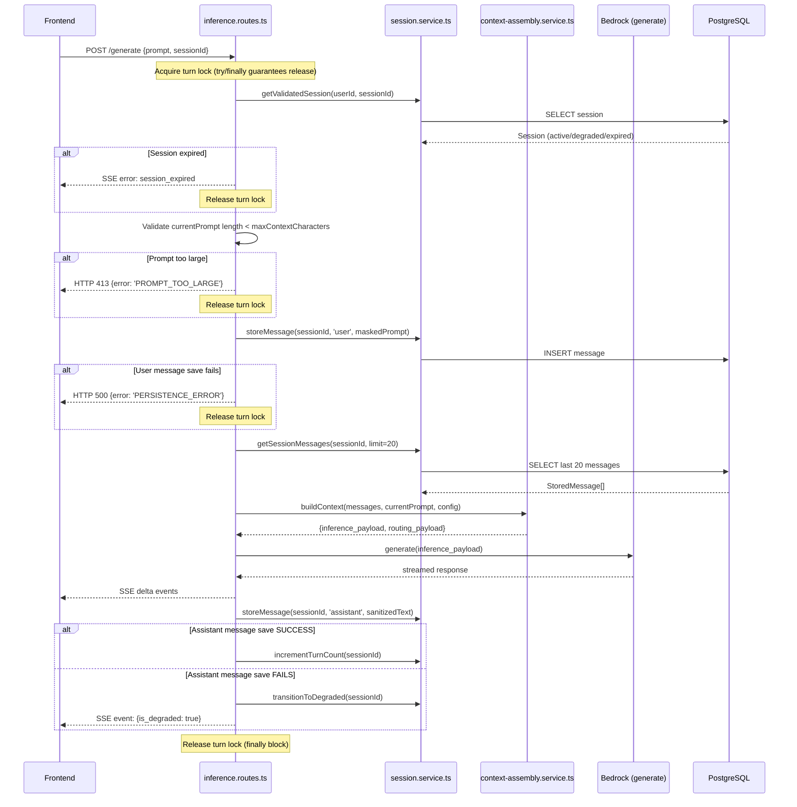

# Design Document: Session Continuity Hardening

## Overview

This feature hardens the existing conversation memory system to ensure reliable turn persistence and session continuity. The current implementation silently swallows persistence failures and uses a complex token-budget approach. This hardening replaces it with:

1. **Fail-fast user message persistence** — if the user message can't be saved, the request is rejected before calling the AI
2. **Degraded session state** — if the assistant message can't be saved, the session transitions to `degraded` and the frontend is notified
3. **Unified context builder** — a single function produces both `inference_payload` and `routing_payload` from the same data
4. **Simple sliding window** — last 10 turns (20 messages) with character-count safety cap, replacing the complex token-budget approach
5. **Frontend degraded-session banner** — visible warning when context may be lost

The design modifies existing services (`session.service.ts`, `context-assembly.service.ts`, `inference.routes.ts`) rather than creating new ones.

## Architecture



### Key Design Decisions

1. **Modify existing services, not new ones**: The session.service.ts gains a `transitionToDegraded()` function and `incrementTurnCount()`. The context-assembly.service.ts is refactored to a simpler sliding-window approach with dual-output.

2. **Character counting as token proxy**: We keep the existing `charsPerToken = 4` approximation but simplify usage — the sliding window (max 10 turns) is the primary limit, and a character-count cap is the safety fallback.

3. **No turn overlap with guaranteed lock release**: The route uses a per-session lock (in-memory Map keyed by sessionId) to prevent concurrent turns. The entire turn lifecycle is wrapped in `try...finally` to **guarantee** lock release regardless of how the function exits (success, AI error, DB error, timeout). Without this, an unhandled exception would permanently lock the session until server restart.

4. **SSE-based degraded notification**: The `is_degraded` flag is sent as an SSE event after the response stream completes (or as part of the session event), not as a separate HTTP response.

5. **Prompt-too-large guard**: Before any persistence or AI call, `buildContext()` checks if `currentPrompt` alone exceeds `maxContextCharacters`. If so, it throws `PromptTooLargeError` (HTTP 413). This prevents an impossible-to-satisfy loop where dropping history messages can't make room because the prompt itself exceeds the budget.

6. **incrementTurnCount only on success**: The turn counter is only incremented after the assistant message is **successfully** persisted. If assistant storage fails, the session degrades but `turn_count` remains accurate — it reflects only fully committed turns.

## Components and Interfaces

### Modified: `src/services/session.service.ts`

New exports added to the existing service:

```typescript
/**
 * Transition a session to 'degraded' state.
 * Called when assistant message persistence fails.
 */
export async function transitionToDegraded(sessionId: string): Promise<void>;

/**
 * Increment the turn_count for a session after a complete turn.
 */
export async function incrementTurnCount(sessionId: string): Promise<void>;

/**
 * Get session with state validation — rejects expired sessions.
 * Returns the session or throws SessionExpiredError / SessionNotFoundError.
 */
export async function getValidatedSession(
  userId: string,
  sessionId?: string
): Promise<Session>;
```

The existing `Session` type gains a `turnCount` field. The DB status CHECK constraint is updated to include `'degraded'`.

### Modified: `src/services/context-assembly.service.ts`

The current `assembleContext()` function is replaced with a simpler `buildContext()`:

```typescript
export interface ContextOutput {
  /** Full message array for Bedrock ConverseStream (system + history + current) */
  inference_payload: BedrockMessage[];
  /** Condensed payload for routing engine (last 2 user messages from history, max 500 chars) */
  routing_payload: string | undefined;
  /** Whether oldest messages were dropped to fit character budget */
  truncated: boolean;
  /** Number of history messages included */
  historyMessageCount: number;
}

/**
 * Build context from session messages using a sliding window.
 * 
 * Algorithm:
 * 1. GUARD: If currentPrompt.length > maxContextCharacters, throw PromptTooLargeError
 * 2. Take the most recent N messages from sessionMessages (default: 20 = 10 turns)
 * 3. If total character count of (history + currentPrompt) exceeds maxContextCharacters,
 *    drop the oldest history messages one-by-one until it fits
 * 4. Format as BedrockMessage array: [system prompt (if set)] + history + current user prompt
 * 5. Extract routing_payload: from the selected history messages (NOT from inference_payload),
 *    filter to role==='user' only, take last 2, concatenate their content, cap at 500 chars.
 *    The system prompt is NEVER included in routing_payload.
 * 
 * @throws PromptTooLargeError if currentPrompt alone exceeds maxContextCharacters
 */
export function buildContext(
  sessionMessages: StoredMessage[],
  currentPrompt: string,
  config: ContextConfig,
): ContextOutput;

export interface ContextConfig {
  maxHistoryMessages: number;    // Default: 20 (10 turns)
  maxContextCharacters: number;  // Default: 120,000
  systemPrompt?: string;         // Optional system prompt to prepend
}
```

### Modified: `src/routes/inference.routes.ts`

Changes to the existing route handler:

1. **Turn locking with guaranteed release**: An in-memory `Map<string, boolean>` tracks in-flight turns per session. The entire turn lifecycle (from session validation through assistant storage) is wrapped in `try...finally` to guarantee the lock is released even on unexpected errors (network timeouts, Bedrock 500s, unhandled exceptions).

```typescript
const activeTurns: Map<string, boolean> = new Map();

// In the route handler:
if (activeTurns.get(sessionId)) {
  return res.status(409).json({ error: 'TURN_IN_PROGRESS' });
}
activeTurns.set(sessionId, true);
try {
  // ... entire turn lifecycle ...
} finally {
  activeTurns.delete(sessionId);
}
```

2. **Fail-fast on user save**: If `storeMessage()` throws for the user message, return HTTP 500 immediately (don't call AI)
3. **Degrade on assistant save failure**: If assistant `storeMessage()` throws, call `transitionToDegraded()` and emit SSE event. Do NOT increment turn count.
4. **Increment turn count only on full success**: `incrementTurnCount()` is called only after the assistant message is successfully persisted.
5. **Use `buildContext()` instead of `assembleContext()`**: The new unified builder is the single source for both routing and inference payloads
6. **Remove `buildRoutingContext()`**: The standalone routing context builder is removed — `buildContext()` handles this
7. **Prompt-too-large pre-check**: Before calling `buildContext()`, validate that `currentPrompt.length` does not exceed `maxContextCharacters`. If it does, return HTTP 413 immediately.

### Modified: `src/config/index.ts`

New config entries:

```typescript
session: {
  // ... existing fields remain ...
  maxHistoryTurns: parseInt(process.env.MAX_HISTORY_TURNS || '10', 10),
  maxContextCharacters: parseInt(process.env.MAX_CONTEXT_CHARACTERS || '120000', 10),
}
```

### Modified: `public/index.html`

Frontend changes:

1. **Degraded banner**: A warning div shown when `is_degraded: true` is received via SSE. The banner persists until the user starts a new chat.
2. **Input locking during streaming**: Disable send button + textarea while a response is in-flight (partially exists already via `isStreaming`)
3. **Session expiry handling**: On `session_expired` or `session_not_found` error, clear UI, reset `currentSessionId`, show toast
4. **Degraded state management**: When `is_degraded: true` is received, the frontend SHALL mark the last assistant message in its local state as "unsaved" (e.g., add a subtle visual indicator). On page refresh, the backend will return DB history (missing the unsaved assistant message), so the frontend must NOT cache and re-display stale messages — it should always trust the backend's `GET /sessions/active` response as the source of truth on reload.

### Database Migration: `migrations/005_session_hardening.sql`

```sql
-- Wrap in transaction to prevent leaving the table without a constraint
-- if the ADD CONSTRAINT fails after the DROP.
BEGIN;

-- Add 'degraded' to session status CHECK constraint
ALTER TABLE sessions DROP CONSTRAINT sessions_status_check;
ALTER TABLE sessions ADD CONSTRAINT sessions_status_check
  CHECK (status IN ('active', 'degraded', 'inactive', 'expired'));

-- Add turn_count column
ALTER TABLE sessions ADD COLUMN turn_count INTEGER NOT NULL DEFAULT 0;

COMMIT;
```

## Data Models

### Updated Session Type

```typescript
export interface Session {
  id: string;
  userId: string;
  status: 'active' | 'degraded' | 'inactive' | 'expired';
  turnCount: number;           // NEW
  createdAt: string;
  updatedAt: string;
  lastActivityAt: string;
  expiresAt: string;
}
```

### ContextConfig

```typescript
export interface ContextConfig {
  maxHistoryMessages: number;     // 2 * MAX_HISTORY_TURNS (default: 20)
  maxContextCharacters: number;   // MAX_CONTEXT_CHARACTERS (default: 120,000)
  systemPrompt?: string;
}
```

### ContextOutput

```typescript
export interface ContextOutput {
  inference_payload: BedrockMessage[];
  routing_payload: string | undefined;
  truncated: boolean;
  historyMessageCount: number;
}
```

### SSE Event: Session Status

```typescript
// Emitted as SSE event after streaming completes if session degraded
interface SessionStatusEvent {
  sessionId: string;
  is_degraded: boolean;
}
```

### Turn Lock (In-Memory)

```typescript
// In inference.routes.ts — prevents concurrent turns on same session.
// CRITICAL: The lock MUST be released in a finally block to prevent permanent lockout
// if Bedrock throws, the DB connection drops, or any unexpected error occurs.
const activeTurns: Map<string, boolean> = new Map();
// Lock:   activeTurns.set(sessionId, true)
// Unlock: activeTurns.delete(sessionId) — always in finally {}
```

## Correctness Properties

*A property is a characteristic or behavior that should hold true across all valid executions of a system — essentially, a formal statement about what the system should do. Properties serve as the bridge between human-readable specifications and machine-verifiable correctness guarantees.*

### Property 1: Sliding window respects message count limit and character budget

*For any* list of StoredMessages (of any length) and any ContextConfig, the `buildContext()` output SHALL contain at most `maxHistoryMessages` history messages in `inference_payload`, AND the total character count of all message content in `inference_payload` (excluding system prompt) SHALL NOT exceed `maxContextCharacters`.

**Validates: Requirements 3.2, 3.4**

### Property 2: Context output structural invariant

*For any* list of StoredMessages, current prompt string, and ContextConfig with a non-empty systemPrompt, the `buildContext()` output SHALL satisfy: (a) `inference_payload` is a non-empty array where the first element has role `'user'` or contains the system prompt text, (b) every element in `inference_payload` has a valid `role` and non-empty `content` array, (c) `routing_payload` is either `undefined` (when no prior user messages exist) or a string, and (d) `inference_payload` ends with the current user prompt.

**Validates: Requirements 3.3, 3.5, 4.2**

### Property 3: Sliding window selects most-recent messages

*For any* list of StoredMessages with length greater than `maxHistoryMessages`, the messages included in `inference_payload` (excluding system prompt and current prompt) SHALL be exactly the last `maxHistoryMessages` messages from the input, preserving chronological order.

**Validates: Requirements 3.2**

### Property 4: Expired session rejection

*For any* session whose `expires_at` timestamp is in the past, calling `getValidatedSession()` SHALL throw a SessionExpiredError, regardless of the session's current status field value.

**Validates: Requirements 1.6**

### Property 5: Degraded state transition is idempotent

*For any* session in `active` or `degraded` state, calling `transitionToDegraded()` SHALL result in the session status being `degraded`. Calling it multiple times on the same session SHALL not throw and SHALL leave the status as `degraded`.

**Validates: Requirements 1.3**

### Property 6: Turn lock prevents concurrent execution

*For any* session with an active turn in-flight, a second request to the same session SHALL be rejected with a concurrency error, while requests to different sessions SHALL proceed independently.

**Validates: Requirements 2.4**

### Property 7: Prompt-too-large rejection

*For any* currentPrompt string whose length exceeds `maxContextCharacters`, calling `buildContext()` SHALL throw a `PromptTooLargeError` without modifying sessionMessages or producing any output. This prevents an impossible-to-satisfy budget loop.

**Validates: Requirements 3.4**

## Error Handling

### Prompt Too Large (Pre-Check Guard)

- **Trigger**: `currentPrompt.length > config.maxContextCharacters` before any DB operations
- **Action**: Return HTTP 413 `{ error: 'PROMPT_TOO_LARGE', message: 'Prompt exceeds maximum allowed length.' }`
- **Side effects**: Log WARN. Do NOT attempt to store the message or call the AI. Release turn lock.
- **Rationale**: If the current prompt alone exceeds the character budget, no amount of history trimming can make room. Failing early avoids wasted DB writes and an inevitable Bedrock rejection.

### User Message Persistence Failure (Fail-Fast)

- **Trigger**: `storeMessage(sessionId, 'user', ...)` throws
- **Action**: Return HTTP 500 `{ error: 'PERSISTENCE_ERROR', message: 'Failed to save message. Please try again.' }`
- **Side effects**: Log ERROR with session ID and error details. Do NOT call the AI. Release turn lock.
- **Frontend**: Displays generic error, re-enables input

### Assistant Message Persistence Failure (Degrade)

- **Trigger**: `storeMessage(sessionId, 'assistant', ...)` throws after streaming is complete
- **Action**: Call `transitionToDegraded(sessionId)`. Emit SSE event `{ is_degraded: true }`. Log WARN.
- **Side effects**: The response has already been streamed to the user — it's not lost. Future requests will include `is_degraded` in the session event.
- **Frontend**: Displays degraded banner

### Session Expired

- **Trigger**: `getValidatedSession()` detects `expires_at` in the past
- **Action**: Return SSE error event `{ error: 'SESSION_EXPIRED', message: 'Session expired' }`
- **Frontend**: Clears chat, resets `currentSessionId`, shows toast "Previous session expired. Started new session."

### Turn Lock Contention

- **Trigger**: Second request arrives for a session that has `activeTurns.get(sessionId) === true`
- **Action**: Return HTTP 409 `{ error: 'TURN_IN_PROGRESS', message: 'Please wait for the current response to finish.' }`
- **Frontend**: Should already prevent this via disabled send button, but this is a server-side safety net.
- **Lock release guarantee**: The lock is always released in a `finally` block. If Bedrock throws a network timeout, if the DB connection drops, or if any unhandled exception occurs, the lock is still released. Without this guarantee, a single error would permanently lock the session.

### Database Connection Failure

- **Trigger**: Any query throws a connection error
- **Action**: Propagate as the relevant error type (PERSISTENCE_ERROR for message saves, SESSION_RETRIEVAL_ERROR for reads)
- **Side effects**: Log ERROR with stack trace

## Testing Strategy

### Property-Based Tests (using fast-check + vitest)

The `buildContext()` function is a pure function with clear input/output behavior and a large input space (variable message counts, message lengths, configurations). Property-based testing is ideal here.

**Library**: `fast-check` (already in devDependencies)
**Minimum iterations**: 100 per property
**Tag format**: `Feature: session-continuity-hardening, Property {N}: {title}`

Properties to implement:
- Property 1: Sliding window message count + character budget bounds
- Property 2: Output structural invariant (format, system prompt, dual output)
- Property 3: Most-recent message selection

Properties 4–6 involve database/concurrency and are better served by unit tests with mocks:
- Property 4 (expired session rejection): Unit test with mocked DB
- Property 5 (degraded transition idempotence): Unit test with mocked DB
- Property 6 (turn lock): Unit test with concurrent promises

### Unit Tests

- Session creation defaults to `active` status
- `transitionToDegraded()` updates DB and returns
- `incrementTurnCount()` increments the counter
- Config reads `MAX_HISTORY_TURNS` and `MAX_CONTEXT_CHARACTERS` with defaults
- Audit log includes `session_state` and `turn_count`
- Route returns HTTP 500 when user message save fails (mocked DB)
- Route emits `is_degraded` SSE event when assistant save fails (mocked DB)
- Route returns HTTP 409 when turn lock is held

### Integration Tests

- Full turn lifecycle: user message → context build → AI response → assistant message → turn complete
- Session expiry flow: expired session → error → new session created
- Degraded flow: active session → assistant save fails → session becomes degraded → next request includes degraded flag

### Manual / Visual Tests

- Frontend degraded banner appears and disappears correctly
- Input field disabled during streaming
- Session expiry toast notification

