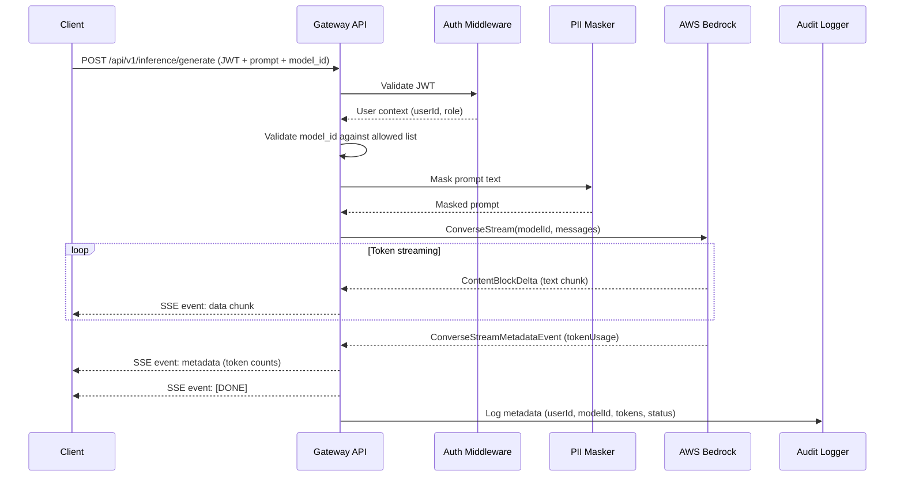

# Design Document: Unified Inference Gateway

## Overview

The Unified Inference Gateway is a built-in backend module for an internal banking application that provides secure access to 5 LLM models via AWS Bedrock in the Jakarta region (ap-southeast-3). It enforces Indonesian financial data sovereignty regulations (OJK/Bank Indonesia) through mandatory one-way PII masking, local JWT-based authentication, region-locked processing, and metadata-only audit logging.

The system operates as a monolithic backend service (Node.js/TypeScript) exposing REST APIs, with streaming inference responses delivered via Server-Sent Events (SSE). It does not include a model recommendation engine — users select models manually from a dropdown with a pre-configured default.

### Key Design Decisions

| Decision | Choice | Rationale |
|----------|--------|-----------|
| Runtime | Node.js + TypeScript | Strong SSE/streaming support, AWS SDK v3 native, async-first |
| PII Detection | Hybrid NER + Regex | Regex for structured patterns (NIK, phone, account), NER for names |
| Masking Strategy | One-way (no unmasking) | Simpler, safer — eliminates in-memory PII mapping risk |
| Auth | Local JWT + bcrypt | No external IDP dependency, whitelist DB for internal use |
| Streaming | SSE via HTTP chunked | Native browser support, simpler than WebSocket for unidirectional flow |
| Database | PostgreSQL (RDS in ap-southeast-3) | Relational for users/audit, encrypted at rest with KMS |
| Cost Display | Frontend-only calculation | No server-side billing — uses local Pricing_Config + token counts from stream metadata |

## Architecture

### High-Level Architecture

```mermaid
graph TB
    subgraph "Client (Browser)"
        UI[Chat UI]
        CostPanel[Cost Display Panel]
        PricingConfig[Pricing_Config JSON]
    end

    subgraph "Backend Service (ap-southeast-3)"
        API[API Layer / Express Router]
        AuthMW[Auth Middleware - JWT Validation]
        AuthSvc[Auth Service]
        PIIMasker[PII Masker Engine]
        InferenceRouter[Inference Router]
        AuditLogger[Audit Logger]
        
        subgraph "Data Stores (ap-southeast-3)"
            WhitelistDB[(Whitelist DB - PostgreSQL)]
            AuditDB[(Audit Log DB - PostgreSQL)]
        end
    end

    subgraph "AWS (ap-southeast-3)"
        Bedrock[AWS Bedrock ConverseStream API]
    end

    UI -->|POST /auth/login| API
    UI -->|POST /inference/generate (SSE)| API
    API --> AuthMW
    AuthMW --> AuthSvc
    AuthSvc --> WhitelistDB
    API --> PIIMasker
    PIIMasker --> InferenceRouter
    InferenceRouter -->|ConverseStream| Bedrock
    InferenceRouter -->|SSE chunks| UI
    InferenceRouter --> AuditLogger
    AuditLogger --> AuditDB
    CostPanel --> PricingConfig
```

### Request Flow (Inference)



### Component Interaction Overview

The system has 5 core backend components with clear responsibilities:

1. **Auth Service** — Credential validation, JWT issuance, user CRUD
2. **Auth Middleware** — JWT verification on protected routes
3. **PII Masker** — Detect and replace PII entities before inference
4. **Inference Router** — Model validation, Bedrock API call, SSE streaming, retry logic
5. **Audit Logger** — Async metadata persistence after each request

## Components and Interfaces

### 1. Auth Service (`/src/services/auth.service.ts`)

**Responsibility:** User authentication, JWT token management, user CRUD operations.

```typescript
interface AuthService {
  login(username: string, password: string): Promise<LoginResult>;
  verifyToken(token: string): Promise<TokenPayload>;
  createUser(admin: TokenPayload, data: CreateUserDto): Promise<UserProfile>;
  updateUser(admin: TokenPayload, userId: string, data: UpdateUserDto): Promise<UserProfile>;
}

interface LoginResult {
  token: string;
  expiresIn: number;
  user: UserProfile;
}

interface TokenPayload {
  sub: string;       // user ID
  username: string;
  role: 'admin' | 'user';
  iat: number;
  exp: number;
}

interface UserProfile {
  id: string;
  username: string;
  role: 'admin' | 'user';
  displayName: string;
  createdAt: string;
  updatedAt: string;
}
```

### 2. Auth Middleware (`/src/middleware/auth.middleware.ts`)

**Responsibility:** Extract and validate JWT from Authorization header on protected routes.

```typescript
interface AuthMiddleware {
  (req: Request, res: Response, next: NextFunction): void;
}

// Attaches decoded token to req.user
// Returns 401 if token is missing, expired, or invalid signature
```

### 3. PII Masker Engine (`/src/services/pii-masker.service.ts`)

**Responsibility:** Detect and replace PII entities in prompt text. One-way masking only.

```typescript
interface PIIMaskerService {
  mask(text: string): MaskResult;
}

interface MaskResult {
  maskedText: string;
  detectedEntities: DetectedEntity[];
  entityCount: number;
}

interface DetectedEntity {
  type: PIIEntityType;
  placeholder: string;
  startIndex: number;
  endIndex: number;
}

type PIIEntityType = 'NIK' | 'NO_REKENING' | 'NO_HP' | 'NAMA' | 'NAMA_BANK';
```

**Detection Strategy (Hybrid):**

| Entity Type | Detection Method | Pattern/Approach |
|-------------|-----------------|------------------|
| NIK | Regex | 16-digit number matching Indonesian province codes |
| NO_REKENING | Regex | 8-15 digit sequences in banking context |
| NO_HP | Regex | Indonesian mobile formats: +62/62/08 followed by 8-12 digits |
| NAMA | NER | Named Entity Recognition for person names (Indonesian + common) |
| NAMA_BANK | Dictionary + Fuzzy Match | Curated list of Indonesian bank names with fuzzy matching |

**Placeholder Assignment:** When multiple entities of the same type are found, indexed placeholders are assigned: `[NAMA_1]`, `[NAMA_2]`, etc.

### 4. Inference Router (`/src/services/inference.service.ts`)

**Responsibility:** Model validation, Bedrock API invocation, SSE streaming, retry with exponential backoff.

```typescript
interface InferenceService {
  generate(request: InferenceRequest, stream: SSEStream): Promise<InferenceResult>;
}

interface InferenceRequest {
  maskedPrompt: string;
  modelId: string;
  userId: string;
  inferenceConfig?: {
    maxTokens?: number;
    temperature?: number;
    topP?: number;
  };
}

interface InferenceResult {
  status: 'success' | 'failed';
  inputTokens: number;
  outputTokens: number;
  modelId: string;
  errorCategory?: 'throttling' | 'timeout' | 'model_error' | 'unknown';
}

// Allowed models (validated before routing)
const ALLOWED_MODELS = [
  'nvidia.nemotron-super-3-120b',
  'openai.gpt-oss-120b-1:0',
  'qwen.qwen3-235b-a22b-2507-v1:0',
  'qwen.qwen3-32b-v1:0',        // default
  'deepseek.v3-v1:0'
] as const;

const DEFAULT_MODEL = 'qwen.qwen3-32b-v1:0';
```

**Retry Logic:**
- Retries only on throttling errors (HTTP 429 / `ThrottlingException`)
- Exponential backoff: `delay = baseDelay * 2^attempt` (base: 1s, max 3 attempts)
- No retry on timeouts or model errors

**SSE Event Format:**
```
event: delta
data: {"type":"text","content":"Hello"}

event: metadata  
data: {"inputTokens":42,"outputTokens":156}

event: done
data: {}

event: error
data: {"message":"Model timeout","category":"timeout"}
```

### 5. Audit Logger (`/src/services/audit.service.ts`)

**Responsibility:** Async persistence of request metadata. Fire-and-forget pattern — never blocks the response.

```typescript
interface AuditService {
  log(entry: AuditEntry): Promise<void>;
}

interface AuditEntry {
  timestamp: string;          // ISO 8601
  userId: string;
  username: string;
  modelId: string;
  inputTokens: number;
  outputTokens: number;
  status: 'success' | 'failed';
  errorCategory?: string;
  durationMs: number;
}
```

### 6. Frontend Cost Display (`/src/frontend/cost-display.ts`)

**Responsibility:** Client-side token counting and cost calculation from SSE metadata events.

```typescript
interface PricingConfig {
  models: Record<string, ModelPricing>;
  currency: 'USD';
  lastUpdated: string;
}

interface ModelPricing {
  modelId: string;
  displayName: string;
  inputPricePer1MTokens: number;   // USD
  outputPricePer1MTokens: number;  // USD
}

interface SessionCostState {
  requests: RequestCost[];
  sessionTotal: number;           // USD
  currentRequest?: {
    modelId: string;
    inputTokens: number;
    outputTokens: number;
    estimatedCost: number;
  };
}

interface RequestCost {
  modelId: string;
  inputTokens: number;
  outputTokens: number;
  cost: number;                   // USD, calculated at THIS model's rate
}
```

### API Endpoints

| Method | Path | Auth | Description |
|--------|------|------|-------------|
| POST | `/api/v1/auth/login` | None | Authenticate user, return JWT |
| POST | `/api/v1/admin/users` | Admin | Register new user |
| PUT | `/api/v1/admin/users/:id` | Admin | Update user profile/role |
| GET | `/api/v1/models` | User | List available models with pricing |
| POST | `/api/v1/inference/generate` | User | Submit prompt, receive SSE stream |

### API Request/Response Contracts

**POST /api/v1/auth/login**
```json
// Request
{ "username": "string", "password": "string" }

// Response 200
{ "token": "jwt...", "expiresIn": 3600, "user": { "id": "...", "username": "...", "role": "user", "displayName": "..." } }

// Response 401
{ "error": "INVALID_CREDENTIALS", "message": "Authentication failed" }
```

**POST /api/v1/inference/generate**
```json
// Request
{
  "prompt": "string",
  "modelId": "qwen.qwen3-32b-v1:0",  // optional, defaults to qwen.qwen3-32b-v1:0
  "config": {                          // optional
    "maxTokens": 4096,
    "temperature": 0.7,
    "topP": 0.9
  }
}

// Response: SSE stream (Content-Type: text/event-stream)
// See SSE Event Format above
```

**POST /api/v1/admin/users**
```json
// Request
{ "username": "string", "password": "string", "role": "user|admin", "displayName": "string" }

// Response 201
{ "id": "...", "username": "...", "role": "user", "displayName": "...", "createdAt": "...", "updatedAt": "..." }

// Response 409
{ "error": "USERNAME_EXISTS", "message": "Username already taken" }
```

## Data Models

### Database Schema (PostgreSQL — ap-southeast-3)

```sql
-- Users table (Whitelist_DB)
CREATE TABLE users (
    id          UUID PRIMARY KEY DEFAULT gen_random_uuid(),
    username    VARCHAR(64) UNIQUE NOT NULL,
    password    VARCHAR(255) NOT NULL,  -- bcrypt hash
    role        VARCHAR(16) NOT NULL DEFAULT 'user' CHECK (role IN ('admin', 'user')),
    display_name VARCHAR(128) NOT NULL,
    created_at  TIMESTAMPTZ NOT NULL DEFAULT NOW(),
    updated_at  TIMESTAMPTZ NOT NULL DEFAULT NOW()
);

CREATE INDEX idx_users_username ON users(username);

-- Audit log table
CREATE TABLE audit_logs (
    id              UUID PRIMARY KEY DEFAULT gen_random_uuid(),
    timestamp       TIMESTAMPTZ NOT NULL DEFAULT NOW(),
    user_id         UUID NOT NULL REFERENCES users(id),
    username        VARCHAR(64) NOT NULL,
    model_id        VARCHAR(128) NOT NULL,
    input_tokens    INTEGER NOT NULL DEFAULT 0,
    output_tokens   INTEGER NOT NULL DEFAULT 0,
    status          VARCHAR(16) NOT NULL CHECK (status IN ('success', 'failed')),
    error_category  VARCHAR(32),
    duration_ms     INTEGER NOT NULL DEFAULT 0
);

CREATE INDEX idx_audit_logs_timestamp ON audit_logs(timestamp);
CREATE INDEX idx_audit_logs_user_id ON audit_logs(user_id);
```

### Pricing_Config (Static JSON — bundled with frontend)

```json
{
  "currency": "USD",
  "lastUpdated": "2026-06-23",
  "models": {
    "nvidia.nemotron-super-3-120b": {
      "displayName": "NVIDIA Nemotron Super 3 120B",
      "inputPricePer1MTokens": 0.18,
      "outputPricePer1MTokens": 0.78
    },
    "openai.gpt-oss-120b-1:0": {
      "displayName": "OpenAI GPT OSS 120B",
      "inputPricePer1MTokens": 0.16,
      "outputPricePer1MTokens": 0.62
    },
    "qwen.qwen3-235b-a22b-2507-v1:0": {
      "displayName": "Qwen3 235B A22B",
      "inputPricePer1MTokens": 0.23,
      "outputPricePer1MTokens": 0.91
    },
    "qwen.qwen3-32b-v1:0": {
      "displayName": "Qwen3 32B (Default)",
      "inputPricePer1MTokens": 0.16,
      "outputPricePer1MTokens": 0.62
    },
    "deepseek.v3-v1:0": {
      "displayName": "DeepSeek V3",
      "inputPricePer1MTokens": 0.60,
      "outputPricePer1MTokens": 1.74
    }
  }
}
```

### AWS Bedrock Integration (ConverseStream)

The Inference Router uses the AWS SDK v3 `BedrockRuntimeClient` with `ConverseStreamCommand`:

```typescript
// Bedrock request structure
interface BedrockConverseStreamInput {
  modelId: string;
  messages: Array<{
    role: 'user' | 'assistant';
    content: Array<{ text: string }>;
  }>;
  inferenceConfig?: {
    maxTokens?: number;
    temperature?: number;
    topP?: number;
  };
}

// Key stream events from Bedrock:
// 1. contentBlockDelta — contains { delta: { text: "..." } }
// 2. metadata — contains { usage: { inputTokens, outputTokens, totalTokens } }
// 3. messageStop — signals end of response
```

The `BedrockRuntimeClient` is configured with:
- `region: 'ap-southeast-3'` (hardcoded — no cross-region fallback)
- Default credential provider chain (IAM role attached to the compute instance)


## Correctness Properties

*A property is a characteristic or behavior that should hold true across all valid executions of a system — essentially, a formal statement about what the system should do. Properties serve as the bridge between human-readable specifications and machine-verifiable correctness guarantees.*

### Property 1: JWT Claims Correctness

*For any* valid user record in the Whitelist_DB (with any username, role, and password), after a successful login the decoded JWT SHALL contain a `sub` matching the user's ID, a `username` matching the stored username, and a `role` matching the stored role.

**Validates: Requirements 1.1**

### Property 2: Auth Error Opacity

*For any* invalid credential combination (non-existent username, correct username with wrong password, or both wrong), the Auth_Service SHALL return an identical error response structure and message, making it impossible to distinguish which credential was incorrect.

**Validates: Requirements 1.2**

### Property 3: JWT Validation Correctness

*For any* JWT token, the auth middleware SHALL accept the token if and only if it has a valid signature AND is not expired. Tokens with tampered signatures, expired tokens, and malformed tokens SHALL all be rejected with HTTP 401.

**Validates: Requirements 1.4, 1.5**

### Property 4: User Profile Password Exclusion

*For any* user creation or retrieval operation, the returned UserProfile object SHALL contain all profile fields (id, username, role, displayName, createdAt, updatedAt) and SHALL NOT contain the password field or any password-derived data.

**Validates: Requirements 2.1**

### Property 5: Admin-Only Access Enforcement

*For any* authenticated user with a non-admin role, requests to user management endpoints (POST /admin/users, PUT /admin/users/:id) SHALL be rejected with HTTP 403, regardless of the request payload.

**Validates: Requirements 2.4**

### Property 6: PII Detection and Masking Completeness

*For any* prompt text containing one or more PII entities (NIK, bank account numbers, phone numbers, person names, bank names), the PII_Masker SHALL detect all entities and replace each with its correct type-specific placeholder token, such that no original PII text remains in the masked output.

**Validates: Requirements 3.1, 4.1**

### Property 7: Unique Indexed Placeholder Assignment

*For any* prompt containing N entities of the same PII type (where N ≥ 2), the PII_Masker SHALL assign uniquely indexed placeholders `[TYPE_1]` through `[TYPE_N]`, with no duplicate indices and no gaps in the sequence.

**Validates: Requirements 3.3**

### Property 8: No-PII Passthrough Identity

*For any* prompt text that contains no detectable PII entities, the PII_Masker SHALL return the text unchanged (masked output equals original input), with zero detected entities.

**Validates: Requirements 3.4**

### Property 9: Masking Preserves Surrounding Structure

*For any* prompt containing PII entities, the masked output SHALL differ from the original ONLY at the positions of the PII entities — all surrounding characters (whitespace, punctuation, non-PII words) SHALL remain identical in content and position.

**Validates: Requirements 4.3**

### Property 10: Model Validation

*For any* model_id string, the Gateway SHALL accept it for inference if and only if it is one of the 5 allowed models. Any string not in the allowed set SHALL be rejected with a validation error, and any string in the allowed set SHALL be passed through to the Bedrock request unchanged.

**Validates: Requirements 5.3, 5.5, 6.2**

### Property 11: Retry Logic with Exponential Backoff

*For any* sequence of K consecutive throttling errors from Bedrock (where 1 ≤ K ≤ 3), the Gateway SHALL retry exactly K times with delays following exponential backoff (delay_i = baseDelay × 2^i), and SHALL not exceed 3 total retry attempts regardless of continued throttling.

**Validates: Requirements 6.4**

### Property 12: Error Message Sanitization

*For any* error response returned from the Bedrock API (containing AWS ARNs, request IDs, internal stack traces, or SDK details), the user-facing error message SHALL not contain any of these internal details — only a sanitized category and user-friendly message.

**Validates: Requirements 6.5**

### Property 13: Audit Entry Completeness and Content Exclusion

*For any* completed inference request (success or failure), the audit log entry SHALL contain all required metadata fields (timestamp, userId, username, modelId, inputTokens, outputTokens, status, durationMs) AND SHALL NOT contain any field storing prompt text or response text.

**Validates: Requirements 8.1, 8.2, 8.4**

### Property 14: Cost Calculation and Session Accumulation

*For any* sequence of N inference requests with varying model selections and token counts, the cost for each individual request SHALL equal `(inputTokens × inputRate + outputTokens × outputRate) / 1,000,000` using that request's specific model rate, and the session total SHALL equal the sum of all individual request costs — switching models between requests SHALL NOT cause recalculation of previously computed costs.

**Validates: Requirements 9.3, 9.4, 9.5**

## Error Handling

### Error Categories and HTTP Status Codes

| Category | HTTP Status | Client Message | Internal Action |
|----------|-------------|----------------|-----------------|
| Invalid credentials | 401 | "Authentication failed" | Log failed attempt |
| Missing/invalid JWT | 401 | "Token invalid or expired" | Reject request |
| Insufficient role | 403 | "Access denied" | Log unauthorized attempt |
| Invalid model_id | 400 | "Invalid model. Choose from: [list]" | Reject pre-Bedrock |
| Empty/blank prompt | 400 | "Prompt cannot be empty" | Reject pre-masking |
| Bedrock throttling | 503 | "Service temporarily busy, retrying..." | Exponential backoff (3 max) |
| Bedrock timeout | 504 | "Model response timed out" | No retry, no fallback |
| Bedrock model error | 502 | "Model processing error" | Log error category |
| Username conflict | 409 | "Username already exists" | Reject registration |
| Pricing_Config unavailable | N/A (frontend) | Show warning, display tokens only | Frontend graceful degradation |

### Error Handling Principles

1. **Never expose internals** — AWS ARNs, request IDs, stack traces, and SDK error messages are logged server-side but never returned to the client.
2. **Consistent error format** — All API errors follow a standard structure:
   ```json
   { "error": "ERROR_CODE", "message": "Human-readable description" }
   ```
3. **Auth errors are opaque** — Login failures never indicate whether the username or password was wrong.
4. **Retry only on throttling** — Only `ThrottlingException` triggers retries. Timeouts and model errors fail immediately.
5. **Audit all failures** — Failed requests are logged with error category but without prompt/response content.
6. **SSE error events** — During streaming, errors are sent as SSE events before closing the connection:
   ```
   event: error
   data: {"error":"TIMEOUT","message":"Model response timed out"}
   ```

### Graceful Degradation

- If audit logging fails (DB connection issue), the inference response still completes — logging is fire-and-forget with background retry.
- If PII masking encounters an internal error, the request is rejected entirely (fail-closed) — never send an unmasked prompt.
- If Pricing_Config is missing, the frontend shows token counts without costs and a warning badge.

## Testing Strategy

### Dual Testing Approach

This feature uses both **unit tests** (example-based) and **property-based tests** (universal properties) for comprehensive coverage.

### Property-Based Testing

**Library:** [fast-check](https://github.com/dubzzz/fast-check) (TypeScript PBT library)
**Configuration:** Minimum 100 iterations per property test
**Tag format:** `Feature: unified-inference-gateway, Property {N}: {title}`

Property-based tests cover:
- PII masking logic (Properties 6, 7, 8, 9) — core correctness of detection and replacement
- Auth logic (Properties 1, 2, 3) — JWT claims and validation
- Model validation (Property 10) — allowed list enforcement
- Cost calculation (Property 14) — formula correctness and accumulation
- Error sanitization (Property 12) — no internal details leak
- Audit completeness (Property 13) — all fields present, no content stored

### Unit Tests (Example-Based)

Unit tests focus on:
- Specific PII regex patterns (NIK format validation, Indonesian phone formats)
- Default model selection when model_id is omitted
- JWT expiry configuration
- Pricing_Config graceful degradation
- API response format validation
- SSE event structure verification

### Integration Tests

Integration tests verify:
- Bedrock client configured for ap-southeast-3 region
- End-to-end SSE streaming from Bedrock through to client
- Database persistence for user registration and audit logs
- Full request flow: auth → mask → inference → audit

### Test Organization

```
/tests
  /unit
    auth.service.test.ts
    pii-masker.service.test.ts
    inference.service.test.ts
    audit.service.test.ts
    cost-calculator.test.ts
  /property
    auth.property.test.ts        # Properties 1, 2, 3, 4, 5
    pii-masker.property.test.ts  # Properties 6, 7, 8, 9
    inference.property.test.ts   # Properties 10, 11, 12
    audit.property.test.ts       # Property 13
    cost.property.test.ts        # Property 14
  /integration
    inference-flow.test.ts
    auth-flow.test.ts
    audit-persistence.test.ts
```
